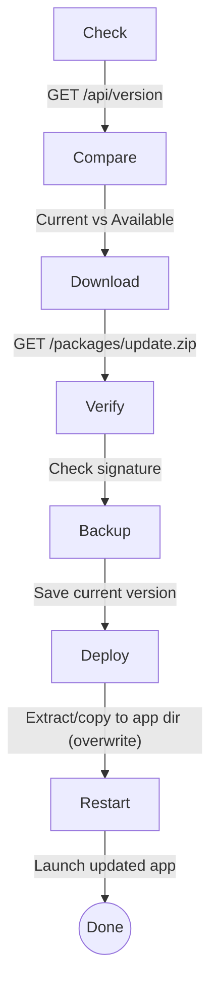

# Updater

Automatic software update application.

## Purpose

Manages software updates:

- Check for new versions
- Download update packages
- Verify signatures
- Apply updates safely
- Rollback on failure

## Building

```bash
cmake --build . --target updater --config Release
```

## Running

```bash
# Check for updates
Updater.exe --check

# Download and install
Updater.exe --install

# Silent mode (no UI)
Updater.exe --silent --install

# Rollback last update
Updater.exe --rollback
```

## Command Line Options

| Option           | Description                |
| ---------------- | -------------------------- |
| `-h, --help`     | Show help                  |
| `-c, --check`    | Check for updates only     |
| `-d, --download` | Download but don't install |
| `-i, --install`  | Install pending update     |
| `-r, --rollback` | Rollback last update       |
| `--silent`       | Run without UI             |
| `--force`        | Force update               |

## Configuration

```ini
[Update]
ServerUrl=https://update.example.com
CheckInterval=3600
AutoDownload=true
AutoInstall=false
VerifySignature=true
BackupBeforeUpdate=true
MaxBackups=3
```

## Update Flow



## Update Mechanism Details

After downloading and verifying update packages, the Updater applies updates as follows:

- **ZIP package components:**
  - The archive is unpacked directly into the application directory (or target destination).
  - All files in the archive are extracted and **overwrite existing files** in the destination (unless the "skip existing" flag is set).
  - There is **no per-file comparison** after extraction; the contents of the archive replace the corresponding files.

- **File set (Folder) components:**
  - Each file is copied from the temporary folder to the destination directory.
  - If a file already exists, it is removed and replaced with the new one (unless "skip existing" is set).

- **Optional files/components** are skipped if not present or empty.

- After deployment, any post-action scripts or executables are run from the temporary folder if specified.

**Summary:** The Updater does not compare files after extraction. It always overwrites destination files with those from the update package, ensuring the application directory matches the update contents.

## Key Files

| File                  | Purpose         |
| --------------------- | --------------- |
| `main.cpp`            | Entry point     |
| `UpdateManager.cpp`   | Update logic    |
| `PackageVerifier.cpp` | Signature check |
| `BackupManager.cpp`   | Backup/restore  |

## Dependencies

- `NetworkTaskManager` - Downloads
- `CryptEngine` - Signature verification
- `SettingsManager` - Configuration

## Platform Support

| Platform | Status | Notes                  |
| -------- | ------ | ---------------------- |
| Windows  | ✅     | Full support           |
| Linux    | 🔬     | Path updates needed    |
| macOS    | 🔬     | Bundle handling needed |
