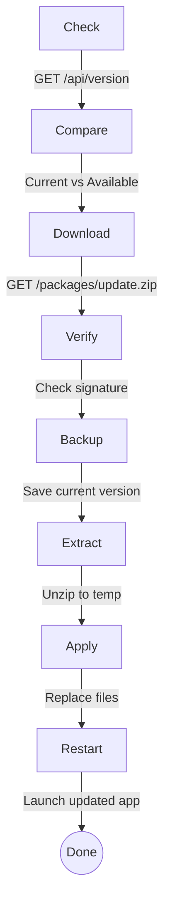

# Updater

Automatic software update application.

## Purpose

Manages software updates:

- Check for new versions
- Download update packages
- Verify signatures
- Apply updates safely
- Rollback on failure

## Building

```bash
cmake --build . --target updater --config Release
```

## Running

```bash
# Check for updates
Updater.exe --check

# Download and install
Updater.exe --install

# Silent mode (no UI)
Updater.exe --silent --install

# Rollback last update
Updater.exe --rollback
```

## Command Line Options

| Option           | Description                |
| ---------------- | -------------------------- |
| `-h, --help`     | Show help                  |
| `-c, --check`    | Check for updates only     |
| `-d, --download` | Download but don't install |
| `-i, --install`  | Install pending update     |
| `-r, --rollback` | Rollback last update       |
| `--silent`       | Run without UI             |
| `--force`        | Force update               |

## Configuration

```ini
[Update]
ServerUrl=https://update.example.com
CheckInterval=3600
AutoDownload=true
AutoInstall=false
VerifySignature=true
BackupBeforeUpdate=true
MaxBackups=3
```

## Update Flow



## Key Files

| File                  | Purpose         |
| --------------------- | --------------- |
| `main.cpp`            | Entry point     |
| `UpdateManager.cpp`   | Update logic    |
| `PackageVerifier.cpp` | Signature check |
| `BackupManager.cpp`   | Backup/restore  |

## Dependencies

- `NetworkTaskManager` - Downloads
- `CryptEngine` - Signature verification
- `SettingsManager` - Configuration

## Platform Support

| Platform | Status | Notes                  |
| -------- | ------ | ---------------------- |
| Windows  | ✅     | Full support           |
| Linux    | 🔬     | Path updates needed    |
| macOS    | 🔬     | Bundle handling needed |
