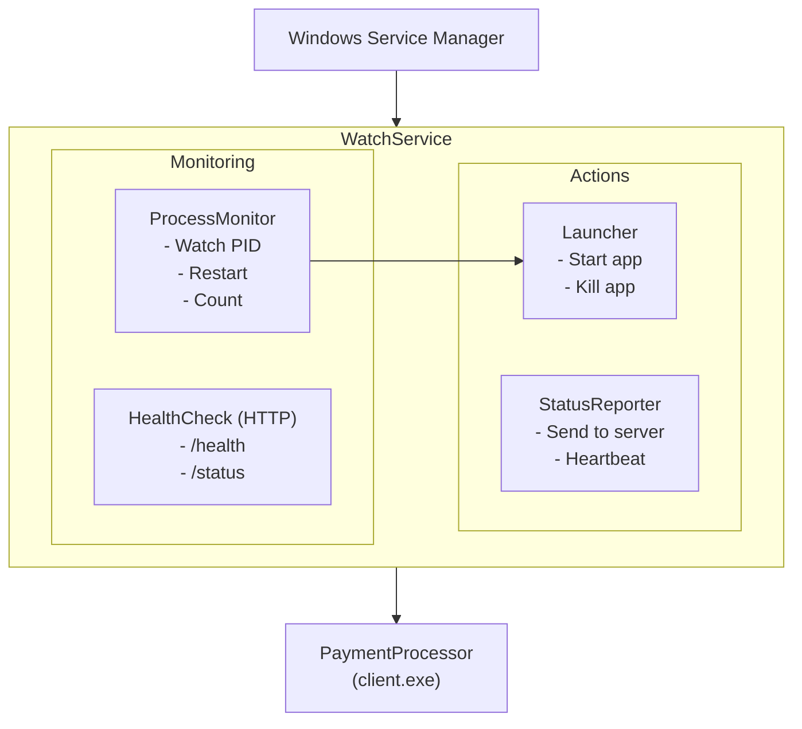

# WatchService (guard)

Process monitoring Windows service.

## Purpose

Runs as a Windows service to:

- Monitor PaymentProcessor process
- Restart on crash
- Report status to server
- Provide health endpoints

## Building

```bash
cmake --build . --target guard --config Release
```

## Installation

```powershell
# Install as Windows service
WatchService.exe --install

# Start service
net start TerminalWatchService

# Stop service
net stop TerminalWatchService

# Uninstall service
WatchService.exe --uninstall
```

## Command Line Options

| Option        | Description         |
| ------------- | ------------------- |
| `--install`   | Install as service  |
| `--uninstall` | Remove service      |
| `--start`     | Start service       |
| `--stop`      | Stop service        |
| `--console`   | Run in console mode |

## Configuration

```ini
[WatchService]
ProcessPath=client.exe
ProcessArgs=--fullscreen
RestartDelay=5000
MaxRestarts=5
ResetInterval=3600

[HealthCheck]
Enabled=true
Port=8080
Endpoint=/health

[Reporting]
ServerUrl=https://monitor.example.com
Interval=60000
```

## Architecture



## Health Check API

```bash
# Check if running
curl http://localhost:8080/health
# Response: {"status": "healthy", "uptime": 3600}

# Get detailed status
curl http://localhost:8080/status
# Response: {"process": "running", "restarts": 0, "pid": 1234}
```

## Communication Protocol

WatchService communicates with modules using a text-based message protocol over TCP/message queues.

### Message Format

Messages use semicolon-separated key-value pairs:

```
sender=SENDER_NAME;target=TARGET_MODULE;type=COMMAND_TYPE;params=PARAMETERS
```

### Message Fields

- `sender`: Module sending the message (e.g., `watch_service`, `ekiosk`, `updater`)
- `target`: Target module to receive command (e.g., `ekiosk`, `updater`, `payment_processor`)
- `type`: Command type (e.g., `start_module`, `close`, `ping`)
- `params`: Optional command parameters (module name, configuration data)

### Available Commands

- `ping`: Health check ping
- `screen_activity`: Report screen activity
- `close`: Close module/service
- `exit`: Exit application
- `start_module`: Start a specific module
- `close_module`: Close a specific module
- `restart`: Restart service
- `reboot`: Reboot system
- `shutdown`: Shutdown system
- `show_splash_screen`: Show protective splash screen
- `hide_splash_screen`: Hide protective splash screen
- `set_state`: Set module state
- `reset_state`: Reset all module states
- `close_logs`: Close log files

### Module Names

- `watch_service`: WatchService itself
- `ekiosk`: Main EKiosk application
- `updater`: Update service
- `tray`: WatchService controller
- `payment_processor`: Payment processing

### Example Messages

```bash
# Service starting a module
sender=watch_service;target=ekiosk;type=start_module;params=payment_processor

# Module reporting status
sender=ekiosk;target=watch_service;type=ping

# Service closing all modules
sender=watch_service;type=close
```

## Key Files

| File                   | Purpose           |
| ---------------------- | ----------------- |
| `main.cpp`             | Entry point       |
| `WatchService.cpp`     | Service logic     |
| `ProcessMonitor.cpp`   | Process watching  |
| `ServiceInstaller.cpp` | Install/uninstall |

## Dependencies

- `SysUtils` - Windows APIs
- `NetworkTaskManager` - Reporting
- `SettingsManager` - Configuration

## Platform Support

| Platform | Status | Notes                |
| -------- | ------ | -------------------- |
| Windows  | ✅     | Full Windows Service |
| Linux    | ❌     | TODO: systemd daemon |
| macOS    | ❌     | TODO: launchd daemon |

## Migration TODO

For Linux/macOS support:

1. Create `LinuxDaemon` implementation
2. Create `MacOSDaemon` implementation
3. Abstract service registration
4. Platform-specific process APIs
