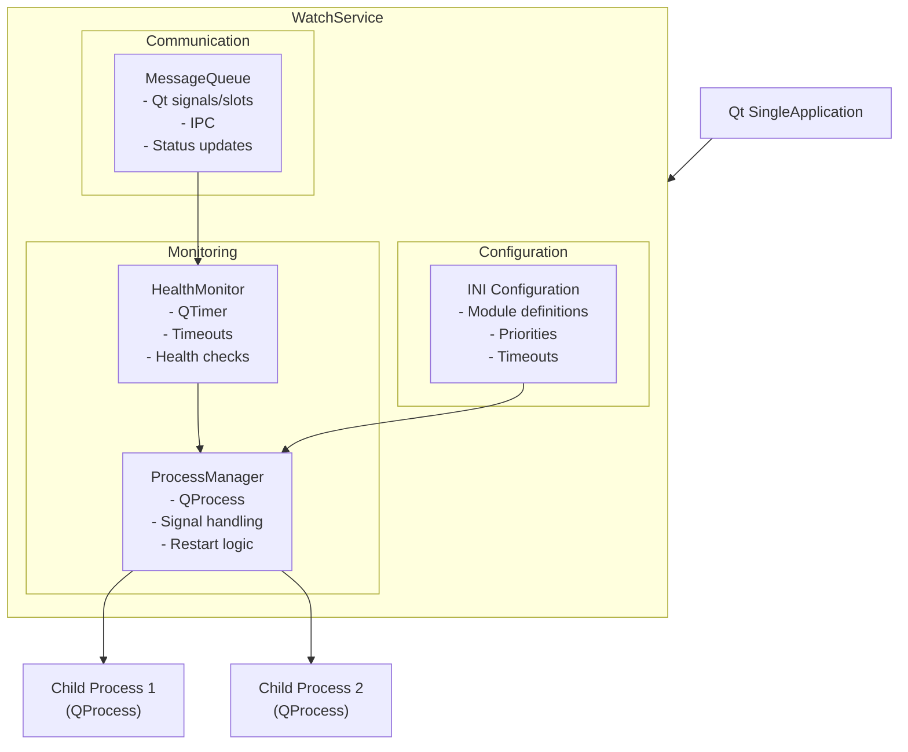

# WatchService (watchdog)

**🔧 Developer Documentation** - Technical details for building and developing the WatchService application.

**📖 For administrators and operators**: See [User Guide](../../docs/apps/watchservice.md) for configuration and operational guidance.

## Purpose

Cross-platform process supervisor and kiosk management daemon that:

- Monitors configured application modules
- Automatically restarts failed processes
- Manages screen protection for unattended kiosks
- Provides health monitoring via message queues
- Ensures single-instance operation

## Building

### Prerequisites

- Qt 5.15+ or Qt 6.x
- CMake 3.16+
- C++11 compatible compiler

### Build Commands

```bash
# Configure (macOS example)
cmake -S . -B build/macos-qt6 -DCMAKE_PREFIX_PATH=/usr/local/opt/qt6

# Build
cmake --build build/macos-qt6 --target watchdog

# Run
./build/macos-qt6/bin/watchdog.app/Contents/MacOS/watchdog
```

### Platform-Specific Notes

- **macOS**: Uses Qt6 from Homebrew (`/usr/local/opt/qt6`)
- **Linux**: Uses system Qt6 packages
- **Windows**: Uses MSVC with Qt6

## Installation

WatchService runs as a regular Qt application. No special installation is required - it can be started directly or integrated into system startup scripts.

### Startup Methods

**Manual startup:**

```bash
# macOS
./build/macos-qt6/bin/watchdog.app/Contents/MacOS/watchdog

# Linux
./build/linux-qt6/bin/watchdog

# Windows
./build/windows-qt6/bin/watchdog.exe
```

**System integration:**

- Add to system startup scripts
- Use launchd (macOS), systemd (Linux), or Task Scheduler (Windows)
- Configure as a background service using platform-specific tools

## Command Line Options

| Option                | Description                                  |
| --------------------- | -------------------------------------------- |
| `--config <file>`     | Specify configuration file path              |
| `--log-level <level>` | Set logging level (debug, info, warn, error) |
| `--daemon`            | Run in background (daemon mode)              |
| `--help`              | Show help information                        |
| `--version`           | Show version information                     |

## Configuration

```ini
[WatchService]
ProcessPath=ekiosk.exe
ProcessArgs=--fullscreen
RestartDelay=5000
MaxRestarts=5
ResetInterval=3600

[HealthCheck]
Enabled=true
Port=8080
Endpoint=/health

[Reporting]
ServerUrl=https://monitor.example.com
Interval=60000
```

## Architecture

WatchService is built using Qt's SingleApplication framework to ensure only one instance runs at a time. It uses Qt's QProcess for managing child processes and QTimer for health monitoring.

### Key Components

- **SingleApplication**: Prevents multiple instances using Qt's cross-platform single instance detection
- **ProcessManager**: Manages child processes using QProcess with proper signal handling
- **HealthMonitor**: Monitors process health using QTimer and configurable timeouts
- **MessageQueue**: Inter-process communication using Qt signals and slots
- **Configuration**: INI-based configuration with module definitions and priorities

### Process Hierarchy

```text
WatchService (Qt SingleApplication)
├── ProcessManager
│   ├── Child Process 1 (QProcess)
│   ├── Child Process 2 (QProcess)
│   └── ...
├── HealthMonitor (QTimer)
└── MessageQueue (Qt signals/slots)
```



## Health Check API

```bash
# Check if running
curl http://localhost:8080/health
# Response: {"status": "healthy", "uptime": 3600}

# Get detailed status
curl http://localhost:8080/status
# Response: {"process": "running", "restarts": 0, "pid": 1234}
```

## Communication Protocol

WatchService communicates with modules using a text-based message protocol over TCP/message queues.

### Message Format

Messages use semicolon-separated key-value pairs:

```text
sender=SENDER_NAME;target=TARGET_MODULE;type=COMMAND_TYPE;params=PARAMETERS
```

### Message Fields

- `sender`: Module sending the message (e.g., `watch_service`, `ekiosk`, `updater`)
- `target`: Target module to receive command (e.g., `ekiosk`, `updater`, `payment_processor`)
- `type`: Command type (e.g., `start_module`, `close`, `ping`)
- `params`: Optional command parameters (module name, configuration data)

### Available Commands

- `ping`: Health check ping
- `screen_activity`: Report screen activity
- `close`: Close module/service
- `exit`: Exit application
- `start_module`: Start a specific module
- `close_module`: Close a specific module
- `restart`: Restart service
- `reboot`: Reboot system
- `shutdown`: Shutdown system
- `show_splash_screen`: Show protective splash screen
- `hide_splash_screen`: Hide protective splash screen
- `set_state`: Set module state
- `reset_state`: Reset all module states
- `close_logs`: Close log files

### Module Names

- `watch_service`: WatchService itself
- `ekiosk`: Main EKiosk application
- `updater`: Update service
- `tray`: WatchService controller
- `payment_processor`: Payment processing

### Example Messages

```bash
# Service starting a module
sender=watch_service;target=ekiosk;type=start_module;params=payment_processor

# Module reporting status
sender=ekiosk;target=watch_service;type=ping

# Service closing all modules
sender=watch_service;type=close
```

## Key Files

| File                 | Purpose                          |
| -------------------- | -------------------------------- |
| `main.cpp`           | Qt application entry point       |
| `WatchService.cpp`   | Main service logic using Qt      |
| `ProcessManager.cpp` | Process management with QProcess |
| `HealthMonitor.cpp`  | Health monitoring with QTimer    |
| `MessageQueue.cpp`   | Inter-process communication      |

## Dependencies

- **Qt Core**: SingleApplication, QProcess, QTimer, signals/slots
- **Common**: BasicApplication, logging infrastructure
- **NetworkTaskManager**: Health check reporting
- **SettingsManager**: Configuration management
- **MessageQueue**: Inter-process communication

## Platform Support

| Platform | Status | Notes                         |
| -------- | ------ | ----------------------------- |
| Windows  | ✅     | Qt-based, full cross-platform |
| Linux    | ✅     | Qt-based, full cross-platform |
| macOS    | ✅     | Qt-based, full cross-platform |

## Implementation Notes

- Uses Qt SingleApplication for cross-platform single-instance detection
- QProcess provides platform-independent child process management
- QTimer handles health monitoring with proper Qt event loop integration
- Message queues use Qt signals/slots for thread-safe inter-process communication
- Configuration is INI-based with Qt's QSettings compatibility

## Related Documentation

- **📖 [User Guide](../../docs/apps/watchservice.md)**: Configuration, operation, and troubleshooting
- **[Configuration Reference](../../docs/configuration-reference.md)**: All configuration options
- **[Modules Documentation](../../docs/modules/)**: Reusable code components
