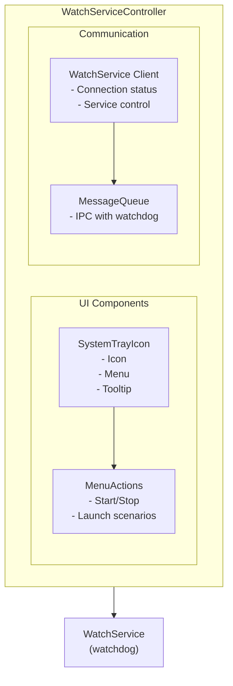

# WatchServiceController (controller)

**🔧 Developer Documentation** - Technical details for building and developing the WatchServiceController application.

**📖 For administrators and operators**: See [User Guide](../../docs/apps/watchservicecontroller.md) for configuration and operational guidance.

System tray controller for WatchService providing cross-platform system tray interface.

## Purpose

Provides system tray interface to:

- Show service connection status
- Start/stop the WatchService daemon
- Launch kiosk application with different scenarios

## Building

### Prerequisites

- Qt 5.15+ or Qt 6.x with Widgets module
- CMake 3.16+
- C++11 compatible compiler

### Build Commands

```bash
# Configure (macOS example)
cmake -S . -B build/macos-qt6 -DCMAKE_PREFIX_PATH=/usr/local/opt/qt6

# Build
cmake --build build/macos-qt6 --target controller

# Run
./build/macos-qt6/bin/controller.app/Contents/MacOS/controller
```

### Platform-Specific Notes

- **macOS**: Uses Qt6 from Homebrew (`/usr/local/opt/qt6`)
- **Linux**: Uses system Qt6 packages with widgets support
- **Windows**: Uses MSVC with Qt6 and Widgets

## Running

### Startup Methods

**Manual startup:**

```bash
# macOS
./build/macos-qt6/bin/controller.app/Contents/MacOS/controller

# Linux
./build/linux-qt6/bin/controller

# Windows
./build/windows-qt6/bin/controller.exe
```

**Command line options:**

```bash
# Normal mode
./controller

# Start minimized to tray
./controller --minimized

# Don't auto-start client
./controller --no-autostart
```

## Command Line Options

| Option           | Description             |
| ---------------- | ----------------------- |
| `-h, --help`     | Show help               |
| `--minimized`    | Start minimized to tray |
| `--no-autostart` | Don't auto-start client |

## Features

### System Tray Menu

```text
┌─────────────────────────────┐
│ ● Status: Connected         │  ← Connected/Disconnected indicator
├─────────────────────────────┤
│ Start service menu          │
│ Start first setup           │
│ Start service               │
├─────────────────────────────┤
│ Stop service                │
├─────────────────────────────┤
│ Close                       │
└─────────────────────────────┘
```

### Status Indicators

| Icon | Status               |
| ---- | -------------------- |
| 🟢   | Connected to service |
| 🔴   | Disconnected         |

## Configuration

WatchServiceController currently does not read configuration files. All settings are hardcoded or use system defaults. Future versions may support configuration files for customization.

## Architecture



## Key Files

| File                         | Purpose                        |
| ---------------------------- | ------------------------------ |
| `main.cpp`                   | Application entry point        |
| `WatchServiceController.h`   | Main controller class header   |
| `WatchServiceController.cpp` | Main controller implementation |

## Dependencies

- `WatchServiceClient` - Service communication
- `MessageQueue` - IPC
- Qt Widgets module

## Platform Support

| Platform | Status | Notes                      |
| -------- | ------ | -------------------------- |
| Windows  | ✅     | Qt-based, full system tray |
| Linux    | ✅     | Qt-based, full system tray |
| macOS    | ✅     | Qt-based, full system tray |

## Implementation Notes

- Uses Qt's cross-platform QSystemTrayIcon for system tray functionality
- Communicates with WatchService via WatchServiceClient for service control
- Supports launching kiosk application with different startup scenarios
- Provides connection status indication through tray icon changes
- Single instance application using SingleApplication framework
- Configuration managed through hardcoded defaults (no external config files)

## Related Documentation

- **📖 [User Guide](../../docs/apps/watchservicecontroller.md)**: Configuration, operation, and troubleshooting
- **[Configuration Reference](../../docs/configuration-reference.md)**: All configuration options
- **[WatchService Documentation](../WatchService/README.md)**: Main service that this controller manages
