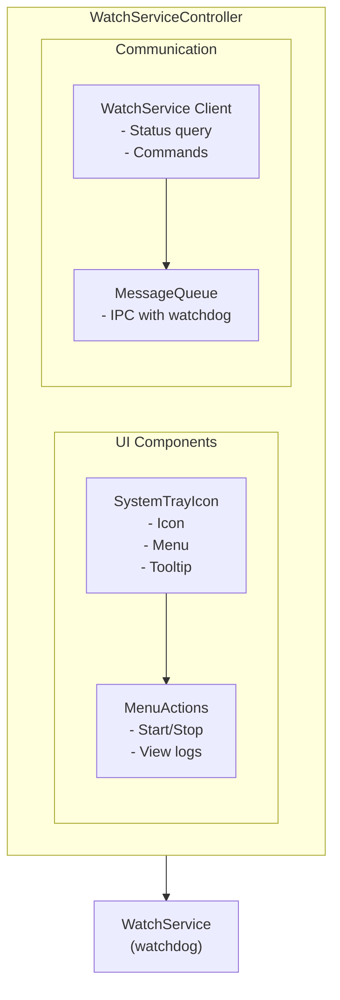

# WatchServiceController (tray)

**🔧 Developer Documentation** - Technical details for building and developing the WatchServiceController application.

**📖 For administrators and operators**: See [User Guide](../../docs/apps/watchservicecontroller.md) for configuration and operational guidance.

System tray controller for WatchService providing cross-platform system tray interface.

## Purpose

Provides system tray interface to:

- Show service status
- Control PaymentProcessor
- View logs
- Quick access to settings

## Building

### Prerequisites

- Qt 5.15+ or Qt 6.x with Widgets module
- CMake 3.16+
- C++11 compatible compiler

### Build Commands

```bash
# Configure (macOS example)
cmake -S . -B build/macos-qt6 -DCMAKE_PREFIX_PATH=/usr/local/opt/qt6

# Build
cmake --build build/macos-qt6 --target tray

# Run
./build/macos-qt6/bin/tray.app/Contents/MacOS/tray
```

### Platform-Specific Notes

- **macOS**: Uses Qt6 from Homebrew (`/usr/local/opt/qt6`)
- **Linux**: Uses system Qt6 packages with widgets support
- **Windows**: Uses MSVC with Qt6 and Widgets

## Running

### Startup Methods

**Manual startup:**

```bash
# macOS
./build/macos-qt6/bin/tray.app/Contents/MacOS/tray

# Linux
./build/linux-qt6/bin/tray

# Windows
./build/windows-qt6/bin/tray.exe
```

**Command line options:**

```bash
# Normal mode
./tray

# Start minimized to tray
./tray --minimized

# Don't auto-start client
./tray --no-autostart
```

## Command Line Options

| Option           | Description             |
| ---------------- | ----------------------- |
| `-h, --help`     | Show help               |
| `--minimized`    | Start minimized to tray |
| `--no-autostart` | Don't auto-start client |

## Features

### System Tray Menu

```text
┌─────────────────────────────┐
│ ● Status: Running           │  ← Green/Red indicator
├─────────────────────────────┤
│ Start Application           │
│ Stop Application            │
│ Restart Application         │
├─────────────────────────────┤
│ View Logs...                │
│ Open Config Folder          │
│ Settings...                 │
├─────────────────────────────┤
│ About                       │
│ Exit                        │
└─────────────────────────────┘
```

### Status Indicators

| Icon | Status               |
| ---- | -------------------- |
| 🟢   | Application running  |
| 🔴   | Application stopped  |
| 🟡   | Starting/restarting  |
| ⚠️   | Error/crash detected |

## Configuration

```ini
[Tray]
AutoStart=true
ShowNotifications=true
MinimizeOnClose=true

[Display]
IconTheme=default
ShowStatusInMenu=true
```

## Architecture



## Key Files

| File                 | Purpose                    |
| -------------------- | -------------------------- |
| `main.cpp`           | Entry point                |
| `TrayController.cpp` | Tray logic                 |
| `TrayMenu.cpp`       | Menu creation              |
| `ServiceClient.cpp`  | WatchService communication |

## Dependencies

- `WatchServiceClient` - Service communication
- `MessageQueue` - IPC
- `SettingsManager` - Configuration
- Qt Widgets module

## Platform Support

| Platform | Status | Notes                      |
| -------- | ------ | -------------------------- |
| Windows  | ✅     | Qt-based, full system tray |
| Linux    | ✅     | Qt-based, full system tray |
| macOS    | ✅     | Qt-based, full system tray |

## Implementation Notes

- Uses Qt's cross-platform QSystemTrayIcon for system tray functionality
- Communicates with WatchService via MessageQueue for IPC
- Supports all major desktop environments on Linux
- Provides fallback behavior when system tray is not available
- Configuration managed through Qt's QSettings framework

## Related Documentation

- **📖 [User Guide](../../docs/apps/watchservicecontroller.md)**: Configuration, operation, and troubleshooting
- **[Configuration Reference](../../docs/configuration-reference.md)**: All configuration options
- **[WatchService Documentation](../WatchService/README.md)**: Main service that this controller manages
