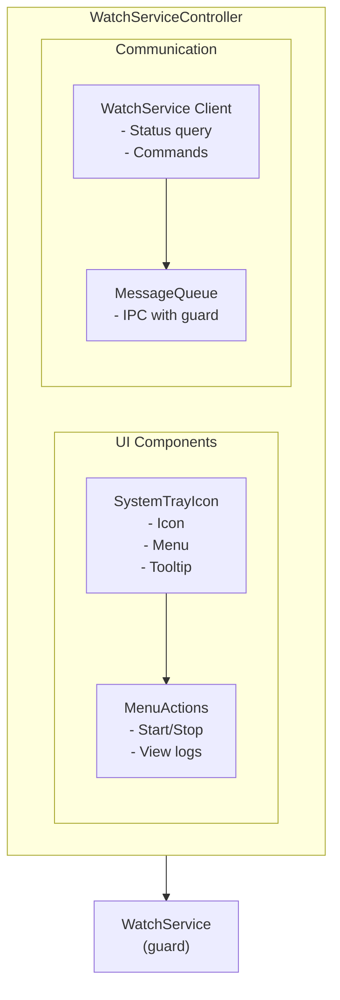

# WatchServiceController (tray)

System tray controller for WatchService.

## Purpose

Provides system tray interface to:

- Show service status
- Control PaymentProcessor
- View logs
- Quick access to settings

## Building

```bash
cmake --build . --target tray --config Release
```

## Running

```bash
# Normal mode
WatchServiceController.exe

# Start minimized
WatchServiceController.exe --minimized

# Don't auto-start client
WatchServiceController.exe --no-autostart
```

## Command Line Options

| Option           | Description             |
| ---------------- | ----------------------- |
| `-h, --help`     | Show help               |
| `--minimized`    | Start minimized to tray |
| `--no-autostart` | Don't auto-start client |

## Features

### System Tray Menu

```
┌─────────────────────────────┐
│ ● Status: Running           │  ← Green/Red indicator
├─────────────────────────────┤
│ Start Application           │
│ Stop Application            │
│ Restart Application         │
├─────────────────────────────┤
│ View Logs...                │
│ Open Config Folder          │
│ Settings...                 │
├─────────────────────────────┤
│ About                       │
│ Exit                        │
└─────────────────────────────┘
```

### Status Indicators

| Icon | Status               |
| ---- | -------------------- |
| 🟢   | Application running  |
| 🔴   | Application stopped  |
| 🟡   | Starting/restarting  |
| ⚠️   | Error/crash detected |

## Configuration

```ini
[Tray]
AutoStart=true
ShowNotifications=true
MinimizeOnClose=true

[Display]
IconTheme=default
ShowStatusInMenu=true
```

## Architecture



## Key Files

| File                 | Purpose                    |
| -------------------- | -------------------------- |
| `main.cpp`           | Entry point                |
| `TrayController.cpp` | Tray logic                 |
| `TrayMenu.cpp`       | Menu creation              |
| `ServiceClient.cpp`  | WatchService communication |

## Dependencies

- `WatchServiceClient` - Service communication
- `MessageQueue` - IPC
- `SettingsManager` - Configuration
- Qt Widgets module

## Platform Support

| Platform | Status | Notes          |
| -------- | ------ | -------------- |
| Windows  | ✅     | Full support   |
| Linux    | 🔬     | Qt system tray |
| macOS    | 🔬     | Qt system tray |

## Notes

- On Linux/macOS, uses Qt's cross-platform system tray
- Some desktop environments may not support tray icons
- Consider fallback for unsupported environments
