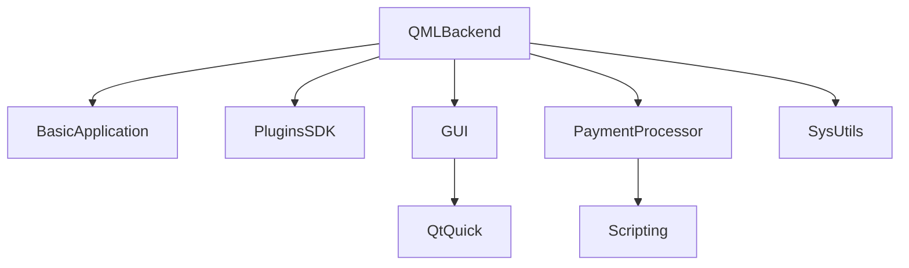

# QMLBackend Plugin Documentation

Comprehensive documentation for the QML (Qt Quick) graphics backend plugin.

## Title & Short Summary

**QMLBackend** - Qt QML-based graphics rendering backend for EKiosk applications.

## Purpose

The QMLBackend plugin provides a modern, declarative UI framework for EKiosk applications using Qt QML and Qt Quick technologies. It serves as the primary graphics rendering backend for:

- **Declarative UI Development**: Enables rapid UI development using QML
- **Modern Graphics**: Leverages Qt Quick scene graph for hardware-accelerated rendering
- **Scripting Integration**: Supports JavaScript and payment processor scripting
- **Cross-Platform**: Provides consistent UI experience across all supported platforms
- **Plugin Architecture**: Implements EKiosk's standard plugin system

This plugin is essential for applications requiring modern, responsive user interfaces with complex animations and transitions.

---

## Quick start 🔧

```cpp
// Access QMLBackend plugin through the plugin system
#include <SDK/Plugins/IPlugin.h>
#include <SDK/GUI/IGraphicsBackend.h>

// Get QMLBackend plugin instance
SDK::Plugin::IPlugin *qmlBackend = environment->getPlugin("qml_backend");
if (qmlBackend && qmlBackend->isReady()) {
    // Access graphics backend interface
    auto graphicsBackend = environment->getInterface<SDK::GUI::IGraphicsBackend>("QMLBackend");
    if (graphicsBackend) {
        // Create QML-based graphics items
        auto mainWindow = graphicsBackend->createGraphicsItem("qml/MainWindow.qml");

        // Execute QML scripts
        QVariant result = graphicsBackend->evaluateScript("1 + 2 * 3");
    }
}
```

---

## Features

### Core Graphics Functionality

- **QML Rendering Engine**: Full Qt Quick scene graph implementation
  - Hardware-accelerated rendering
  - Smooth animations and transitions
  - Custom QML components support
  - Qt Quick controls integration

- **Scripting Integration**: Comprehensive scripting support
  - JavaScript execution in QML context
  - Payment processor script integration
  - Script-based UI logic
  - Dynamic content generation

- **Graphics Item Management**: Advanced graphics item handling
  - QML-based graphics item creation
  - Graphics item lifecycle management
  - Z-order and visibility control
  - Item transformation and effects

- **Plugin Architecture**: Standard EKiosk plugin implementation
  - Plugin lifecycle management
  - Service registration and discovery
  - Configuration management
  - Error handling and logging

### Plugin Components

- **QMLBackend**: Main plugin class and graphics backend implementation
- **QMLBackendFactory**: Plugin factory with metadata and creation
- **QMLGraphicsItem**: QML-based graphics item wrapper
- **Md5ValidatorQmlItem**: MD5 validation QML component
- **ScriptCore**: Payment processor scripting integration

### Integration Points

- **EKiosk Kernel**: Core application services and lifecycle
- **Qt QML Engine**: QML execution environment
- **Payment Processor**: Scripting and transaction integration
- **Graphics System**: Rendering and display management
- **Plugin System**: Standard EKiosk plugin infrastructure

---

## Platform support

### Qt Version Compatibility

**Qt Version Support:**

- ✅ Qt5 compatible
- ✅ Qt6 compatible
- Automatic version detection and module selection

The QMLBackend plugin is designed to work seamlessly with both Qt5 and Qt6, automatically selecting appropriate modules and APIs.

### Platform Support Table

- **Windows**: ✅ Full - Complete QML functionality
  - DirectX-based rendering
  - Full Qt Quick support
  - Hardware acceleration
  - Native integration

- **Linux**: ✅ Full - Complete functionality with platform optimizations
  - OpenGL-based rendering
  - Full Qt Quick support
  - Hardware acceleration
  - Wayland/X11 support

- **macOS**: 🔬 TODO - Limited testing, core functionality should work
  - Metal-based rendering
  - Basic functionality tested
  - Requires additional testing for production
  - May need platform-specific adjustments

---

## Configuration

The QMLBackend plugin supports comprehensive runtime configuration:

```cpp
// Get current configuration
QVariantMap config = qmlBackend->getConfiguration();

// Update configuration options
config["qmlImportPaths"] = QStringList() << "/custom/qml/modules" << "/system/qml";
config["scriptEngine"] = "enabled";
config["graphicsBackend"] = "qml";
config["enableCache"] = true;
config["cacheSize"] = 1024; // MB
config["debugMode"] = false;

// Apply configuration
qmlBackend->setConfiguration(config);

// Save configuration permanently
qmlBackend->saveConfiguration();
```

### Configuration Options Reference

| Option              | Type        | Default     | Description                 | Example Values                   |
| ------------------- | ----------- | ----------- | --------------------------- | -------------------------------- |
| `qmlImportPaths`    | QStringList | `[]`        | Additional QML import paths | `["/custom/qml", "/system/qml"]` |
| `scriptEngine`      | string      | `"enabled"` | Script engine status        | `"enabled"`, `"disabled"`        |
| `graphicsBackend`   | string      | `"qml"`     | Graphics backend type       | `"qml"`, `"native"`              |
| `enableCache`       | bool        | `true`      | Enable QML cache            | `true`, `false`                  |
| `cacheSize`         | int         | `512`       | QML cache size in MB        | `256`, `512`, `1024`             |
| `debugMode`         | bool        | `false`     | Enable debug logging        | `true`, `false`                  |
| `enableProfiler`    | bool        | `false`     | Enable QML profiler         | `true`, `false`                  |
| `preloadComponents` | bool        | `true`      | Preload QML components      | `true`, `false`                  |

### Configuration File Format

Configuration is stored in INI format:

```ini
[QMLBackend]
; QML import and caching
qmlImportPaths=/custom/qml/modules;/system/qml
enableCache=true
cacheSize=512

; Scripting and debugging
scriptEngine=enabled
debugMode=false
enableProfiler=false

; Performance settings
preloadComponents=true
enableHardwareAcceleration=true
```

---

## Usage / API highlights

### Main Plugin Operations

```cpp
// Plugin lifecycle management
bool initialized = qmlBackend->initialize();
bool started = qmlBackend->start();
bool stopped = qmlBackend->stop();

// Plugin state management
qmlBackend->show();
qmlBackend->hide();
qmlBackend->reset(QVariantMap());

// Plugin status
bool isReady = qmlBackend->isReady();
QString error = qmlBackend->getError();
QVariantMap context = qmlBackend->getContext();
```

### Graphics Backend API

```cpp
// Create QML-based graphics items
QSharedPointer<SDK::GUI::IGraphicsItem> mainWindow =
    graphicsBackend->createGraphicsItem("qml/MainWindow.qml");

QSharedPointer<SDK::GUI::IGraphicsItem> dialog =
    graphicsBackend->createGraphicsItem("qml/Dialog.qml");

// Execute QML scripts
QVariant scriptResult = graphicsBackend->evaluateScript("function test() { return 42; } test();");
QVariant expressionResult = graphicsBackend->evaluateExpression("width * height");

// Access QML engine
QQmlEngine *engine = graphicsBackend->getQmlEngine();
if (engine) {
    // Register custom types
    qmlRegisterType<CustomComponent>("Custom", 1, 0, "CustomComponent");

    // Set context properties
    engine->rootContext()->setContextProperty("appVersion", "1.0.0");
}

// Manage graphics items
graphicsBackend->addGraphicsItem(mainWindow);
graphicsBackend->removeGraphicsItem(dialog);
QList<QSharedPointer<SDK::GUI::IGraphicsItem>> items = graphicsBackend->getGraphicsItems();
```

### Scripting Integration API

```cpp
// Access script core
auto scriptCore = graphicsBackend->getScriptCore();
if (scriptCore) {
    // Execute payment scripts
    QVariantMap paymentData;
    paymentData["amount"] = 1000;
    paymentData["currency"] = "UZS";
    paymentData["transactionId"] = "TXN12345";

    QVariant paymentResult = scriptCore->executePaymentScript(paymentData);

    // Execute custom scripts
    QString scriptCode = "function calculateTotal(items) { ... }";
    QVariant scriptResult = scriptCore->executeScript(scriptCode, "calculateTotal");

    // Call script functions
    QVariantList args;
    args << QVariant(100) << QVariant(20);
    QVariant functionResult = scriptCore->callScriptFunction("calculateTotal", args);
}
```

### Advanced QML Features

```cpp
// Load QML from different sources
QSharedPointer<SDK::GUI::IGraphicsItem> fromFile =
    graphicsBackend->createGraphicsItemFromFile("/path/to/component.qml");

QSharedPointer<SDK::GUI::IGraphicsItem> fromUrl =
    graphicsBackend->createGraphicsItemFromUrl(QUrl("https://example.com/component.qml"));

QSharedPointer<SDK::GUI::IGraphicsItem> fromString =
    graphicsBackend->createGraphicsItemFromString("import QtQuick 2.0; Rectangle { width: 100; height: 100 }");

// QML component management
bool componentRegistered = graphicsBackend->registerQmlComponent("CustomButton", "qml/CustomButton.qml");
QSharedPointer<SDK::GUI::IGraphicsItem> customButton = graphicsBackend->createComponentInstance("CustomButton");

// QML context management
graphicsBackend->setQmlContextProperty("userName", "John Doe");
graphicsBackend->setQmlContextProperty("appSettings", QVariantMap{{"theme", "dark"}, {"language", "en"}});

// QML signal handling
connect(graphicsBackend, &SDK::GUI::IGraphicsBackend::qmlSignalEmitted,
        this, &MyClass::handleQmlSignal);

graphicsBackend->emitQmlSignal("updateStatus", QVariantList{"complete", 100});
```

---

## Integration

### CMake Configuration

The QMLBackend plugin uses the standard EKiosk plugin CMake configuration:

```cmake
# Plugin source files
set(QMLBACKEND_SOURCES
    src/QMLBackend.cpp
    src/QMLBackend.h
    src/QMLBackendFactory.cpp
    src/QMLBackendFactory.h
    src/QMLGraphicsItem.cpp
    src/QMLGraphicsItem.h
    src/Md5ValidatorQmlItem.h
)

# Plugin definition
ek_add_plugin(qml_backend
    FOLDER "plugins/GraphicBackends"

    # Source files
    SOURCES ${QMLBACKEND_SOURCES}

    # Required Qt modules (automatic version detection)
    QT_MODULES
        Core      # Core Qt functionality
        Widgets   # Widget support
        Quick     # Qt Quick framework
        Qml       # QML language support
        WebEngineCore  # WebEngine for Qt6
        # WebEngine for Qt5 (automatically selected)

    # Internal dependencies
    DEPENDS
        BasicApplication    # Core application framework
        PluginsSDK          # Plugin system infrastructure
        GUI                 # Graphics user interface
        PaymentProcessor    # Payment processing integration
        SysUtils            # System utilities

    # Include directories
    INCLUDE_DIRS
        ${CMAKE_CURRENT_SOURCE_DIR}/src

    # Installation directory
    INSTALL_DIR
        plugins
)
```

### Build Process

```bash
# Configure the project with specific preset
cmake --preset win-msvc-qt5-x64

# Build the QMLBackend plugin specifically
cmake --build build/win-msvc-qt5-x64 --target qml_backend

# Build with verbose output for debugging
cmake --build build/win-msvc-qt5-x64 --target qml_backend --verbose

# Clean and rebuild
cmake --build build/win-msvc-qt5-x64 --target clean
cmake --build build/win-msvc-qt5-x64 --target qml_backend
```

### Plugin Loading Sequence

1. **Discovery**: Qt plugin system scans plugin directories
2. **Registration**: QMLBackend registers with EKiosk plugin system
3. **Instantiation**: Plugin factory creates plugin instances
4. **Initialization**: Plugin receives environment and initializes QML engine
5. **Service Registration**: Graphics backend registers with kernel
6. **Script Registration**: Script core registers with payment processor
7. **Operation**: Plugin becomes available for UI rendering

### Dependency Management

The QMLBackend plugin has a well-defined dependency hierarchy:



### Integration with EKiosk Services

```cpp
// Service integration during plugin initialization
bool QMLBackend::initialize() {
    // Register with core services
    auto core = mEnvironment->getInterface<SDK::PaymentProcessor::ICore>();
    if (core) {
        // Register graphics backend
        core->registerService("QMLBackend", this);

        // Register script core
        core->registerScriptCore(mScriptCore);

        // Register event handlers
        core->registerEventHandler("qml.ready", this, &QMLBackend::handleQmlReady);
        core->registerEventHandler("script.error", this, &QMLBackend::handleScriptError);
    }

    // Initialize QML engine
    mQmlEngine = new QQmlEngine(this);
    initializeQmlEngine();

    // Load configuration
    loadConfiguration();

    return true;
}
```

---

## Testing

### Test Framework Architecture

The QMLBackend plugin includes comprehensive testing using the EKiosk mock kernel infrastructure:

```
tests/plugins/GraphicBackends/QMLBackend/
├── qml_backend_test.cpp          # Main test suite
├── mock_graphics_backend.h/.cpp  # Mock graphics backend
├── mock_script_core.h/.cpp       # Mock script core
├── test_qml/                     # Test QML components
├── test_scripts/                 # Test script files
└── CMakeLists.txt                # Test build configuration
```

### Test Coverage Matrix

| Component          | Unit Tests | Integration Tests | Error Paths | Performance Tests |
| ------------------ | ---------- | ----------------- | ----------- | ----------------- |
| Plugin Loading     | ✅         | ✅                | ✅          | ❌                |
| Configuration      | ✅         | ✅                | ✅          | ❌                |
| Graphics Backend   | ✅         | ✅                | ✅          | ✅                |
| QML Engine         | ✅         | ✅                | ✅          | ✅                |
| Script Integration | ✅         | ✅                | ✅          | ✅                |
| Graphics Items     | ✅         | ✅                | ✅          | ✅                |
| Error Handling     | ✅         | ✅                | ✅          | ❌                |

### Test Implementation Examples

```cpp
#include "../common/PluginTestBase.h"
#include <SDK/GUI/IGraphicsBackend.h>
#include <SDK/PaymentProcessor/Scripting/Core.h>

class QMLBackendTest : public QObject {
    Q_OBJECT

private slots:
    // Core functionality tests
    void testPluginLoading();
    void testPluginInitialization();
    void testConfigurationManagement();

    // Graphics backend tests
    void testGraphicsItemCreation();
    void testGraphicsItemManagement();
    void testQmlEngineAccess();

    // Scripting tests
    void testScriptExecution();
    void testPaymentScriptProcessing();
    void testScriptErrorHandling();

    // Integration tests
    void testKernelIntegration();
    void testServiceRegistration();
    void testEventHandling();
};

void QMLBackendTest::testGraphicsItemCreation() {
    // Test QML graphics item creation
    QSharedPointer<SDK::GUI::IGraphicsItem> item =
        mGraphicsBackend->createGraphicsItem("qml/TestComponent.qml");

    QVERIFY(item != nullptr);
    QVERIFY(item->isValid());
    QCOMPARE(item->getType(), QString("qml"));

    // Test item properties
    QVariantMap properties = item->getProperties();
    QVERIFY(properties.contains("width"));
    QVERIFY(properties.contains("height"));
}

void QMLBackendTest::testScriptExecution() {
    // Test script execution
    QVariantMap paymentData;
    paymentData["amount"] = 1000;
    paymentData["currency"] = "UZS";

    QVariant result = mScriptCore->executePaymentScript(paymentData);
    QVERIFY(result.isValid());
    QVERIFY(result.toMap().contains("success"));
    QCOMPARE(result.toMap()["success"].toBool(), true);
}
```

### Test Execution

```bash
# Run QMLBackend plugin tests specifically
cmake --build build/win-msvc-qt5-x64 --target qml_backend_test

# Run tests with detailed output
ctest --output-on-failure --verbose -R qml_backend

# Run specific test cases
ctest --output-on-failure -R "QMLBackendTest.*Graphics"

# Run with memory checking (Valgrind)
valgrind --leak-check=full cmake --build build/linux-gcc-qt5-x64 --target qml_backend_test

# Generate test coverage report
cmake --build build/linux-gcc-qt5-x64 --target coverage
```

---

## Dependencies

### Internal Dependency Analysis

| Dependency           | Purpose                                     | Version Requirements | Criticality |
| -------------------- | ------------------------------------------- | -------------------- | ----------- |
| **BasicApplication** | Core application framework and utilities    | 1.0+                 | ✅ Critical |
| **PluginsSDK**       | Plugin system infrastructure and interfaces | 1.0+                 | ✅ Critical |
| **GUI**              | Graphics user interface framework           | 1.0+                 | ✅ Critical |
| **PaymentProcessor** | Payment processing and scripting            | 1.0+                 | ✅ Critical |
| **SysUtils**         | System utilities and helpers                | 1.0+                 | ✅ Critical |

### External Dependency Analysis

| Dependency           | Purpose               | Version Requirements | Platform Notes |
| -------------------- | --------------------- | -------------------- | -------------- |
| **Qt Core**          | Core Qt functionality | Qt5.6+ or Qt6.0+     | Cross-platform |
| **Qt Widgets**       | Widget support        | Qt5.6+ or Qt6.0+     | Cross-platform |
| **Qt Quick**         | Qt Quick framework    | Qt5.6+ or Qt6.0+     | Cross-platform |
| **Qt Qml**           | QML language support  | Qt5.6+ or Qt6.0+     | Cross-platform |
| **Qt WebEngineCore** | WebEngine for Qt6     | Qt6.0+               | Cross-platform |
| **Qt WebEngine**     | WebEngine for Qt5     | Qt5.6+               | Cross-platform |

### Platform-Specific Dependencies

| Platform    | Dependency | Purpose            | Notes     |
| ----------- | ---------- | ------------------ | --------- |
| **Windows** | DirectX    | Graphics rendering | Automatic |
| **Linux**   | OpenGL     | Graphics rendering | Automatic |
| **macOS**   | Metal      | Graphics rendering | Automatic |
| **All**     | OpenGL/ES  | Fallback rendering | Optional  |

---

## Troubleshooting

### Comprehensive Issue Resolution Guide

#### Plugin Loading Issues

**Symptom**: Plugin fails to load during application startup
**Root Causes**:

- Missing Qt QML modules
- Incorrect plugin metadata
- Configuration file errors
- Qt version mismatch

**Diagnostic Steps**:

```bash
# Verify plugin file integrity
checksum plugins/libqml_backend.so

# Check Qt module availability
qmlscene --version

# Validate plugin metadata
validate_plugin_metadata qml_backend
```

**Resolution Matrix**:

| Issue                | Detection                          | Resolution                | Prevention                   |
| -------------------- | ---------------------------------- | ------------------------- | ---------------------------- |
| Missing Qt modules   | `qmlscene` fails                   | Install Qt QML modules    | Document Qt requirements     |
| Version mismatch     | Plugin fails with Qt version error | Use compatible Qt version | Specify version requirements |
| Configuration errors | Plugin logs parse errors           | Fix configuration syntax  | Validate configuration files |
| QML import issues    | Components not found               | Set correct import paths  | Document import path setup   |

#### QML Rendering Issues

**Symptom**: QML components not rendering correctly
**Root Causes**:

- Invalid QML syntax
- Missing QML imports
- Resource path issues
- Graphics driver problems

**Diagnostic Commands**:

```cpp
// Check QML engine status
bool engineOk = graphicsBackend->checkQmlEngine();
QVariantMap engineStatus = graphicsBackend->getQmlEngineStatus();

// Validate QML components
bool componentValid = graphicsBackend->validateQmlComponent("MainWindow.qml");
QVariantMap validationResult = graphicsBackend->getValidationResult();
```

**Common Solutions**:

```cpp
// Fix QML import paths
QStringList importPaths;
importPaths << "qrc:/qml" << "/system/qml" << "/custom/qml";
graphicsBackend->setQmlImportPaths(importPaths);

// Reload QML engine
graphicsBackend->reloadQmlEngine();

// Clear QML cache
graphicsBackend->clearQmlCache();
```

#### Script Execution Issues

**Symptom**: QML scripts not executing properly
**Root Causes**:

- JavaScript syntax errors
- Payment processor unavailable
- Script context issues
- Security restrictions

**Script Debugging**:

```cpp
// Enable script debugging
QVariantMap debugConfig;
debugConfig["scriptDebug"] = true;
debugConfig["logScripts"] = true;
qmlBackend->setConfiguration(debugConfig);

// Test script execution
QVariantMap testScript;
testScript["code"] = "function test() { return 'success'; }";
testScript["context"] = QVariantMap{{"debug", true}};

QVariant result = graphicsBackend->testScriptExecution(testScript);
```

**Script Recovery**:

```cpp
// Handle script errors
connect(graphicsBackend, &SDK::GUI::IGraphicsBackend::scriptError,
        this, &ErrorHandler::handleScriptError);

// Reset script engine
graphicsBackend->resetScriptEngine();

// Recompile scripts
bool recompiled = graphicsBackend->recompileScripts();
```

#### Performance Issues

**Symptom**: Slow QML rendering or high CPU usage
**Root Causes**:

- Complex QML components
- Excessive animations
- Memory leaks
- Inefficient bindings

**Performance Diagnostics**:

```bash
# CPU profiling
perf record -g -p $(pidof ekiosk)
perf report

# Memory profiling
valgrind --tool=massif ekiosk
ms_print massif.out.*

# QML profiling
QML_SCENE_GRAPH_DEBUG=1 ekiosk
```

**Performance Optimization**:

```cpp
// Enable performance monitoring
QVariantMap perfConfig;
perfConfig["enableProfiler"] = true;
perfConfig["frameRateLimit"] = 60;
qmlBackend->setConfiguration(perfConfig);

// Optimize QML components
graphicsBackend->optimizeQmlComponents();

// Enable caching
graphicsBackend->setCacheEnabled(true);
graphicsBackend->setCacheSize(1024);
```

---

## Migration notes

### Version Compatibility Matrix

| Version | Qt5 Support | Qt6 Support | API Stability | Notes                       |
| ------- | ----------- | ----------- | ------------- | --------------------------- |
| 1.0     | ✅ Full     | ✅ Full     | ✅ Stable     | Current production version  |
| 0.9     | ✅ Full     | ❌ None     | ⚠️ Beta       | Beta with basic QML support |
| 0.5-0.8 | ✅ Partial  | ❌ None     | ❌ Unstable   | Development versions        |

### API Evolution Timeline

**1.0 (Current)**:

- Stable API with comprehensive QML support
- Full Qt5/Qt6 compatibility
- Complete scripting integration
- Production-ready performance

**0.9 (Beta)**:

- Added basic QML rendering
- Limited scripting support
- Basic graphics item management
- Qt5 only

**0.5-0.8 (Development)**:

- Experimental QML integration
- Incomplete functionality
- Limited testing
- Not production-ready

### Migration Paths

**From 0.9 to 1.0**:

```bash
# No breaking changes
# Configuration format unchanged
# API fully compatible
# Recommended upgrade for all users

# Migration steps:
1. Backup existing QML components
2. Update plugin files
3. Test QML rendering
4. Verify scripting integration
5. Deploy to production
```

**From Legacy Systems**:

```bash
# Significant changes required
# Complete QML rewrite recommended
# Configuration format changes
# Comprehensive testing required

# Migration steps:
1. Analyze legacy UI components
2. Rewrite in QML/Qt Quick
3. Update configuration files
4. Test migration in staging
5. Gradual production rollout
6. Monitor performance
```

### Breaking Changes History

**No breaking changes in current version (1.0)**

**Potential Future Breaking Changes (2.0)**:

- QML API updates
- Scripting architecture changes
- Graphics item management improvements
- Performance optimizations

All breaking changes will be:

1. Documented in migration guides
2. Announced well in advance
3. Provided with migration tools
4. Supported with backward compatibility where possible

---

## Further reading

### Core Documentation

- [Plugin System Architecture](README.md#plugin-architecture)
- [EKiosk Developer Guide](../../docs/getting-started.md)
- [Testing Guide](../../docs/testing.md)
- [CMake Build System](../../docs/build-guide.md)

### Related Services

- [GUI Service Documentation](../../docs/services/gui.md)
- [Payment Processor Documentation](../../docs/services/payment.md)
- [Scripting Documentation](../../docs/services/scripting.md)

### External Resources

- [Qt QML Documentation](https://doc.qt.io/qt-6/qmlapplications.html)
- [Qt Quick Documentation](https://doc.qt.io/qt-6/qtquick-index.html)
- [QML Best Practices](https://doc.qt.io/qt-6/qtquick-bestpractices.html)

### Source Code Reference

- **Main Plugin**: `src/plugins/GraphicBackends/QMLBackend/`
- **Tests**: `tests/plugins/GraphicBackends/QMLBackend/`
- **Documentation**: `docs/plugins/qmlbackend.md`
- **Examples**: `examples/qml_backend/`

---

## Configuration Reference

### Complete Configuration Specification

```ini
[QMLBackend]
; =============================================
; QML ENGINE SETTINGS
; =============================================
; Additional QML import paths (semicolon-separated)
qmlImportPaths=/custom/qml/modules;/system/qml

; Enable QML engine
enableQmlEngine=true

; Enable QML cache
enableCache=true

; QML cache size in MB
cacheSize=512

; =============================================
; SCRIPTING SETTINGS
; =============================================
; Enable script engine
scriptEngine=enabled

; Enable payment scripting
enablePaymentScripts=true

; Script timeout in milliseconds
scriptTimeout=5000

; =============================================
; PERFORMANCE SETTINGS
; =============================================
; Enable hardware acceleration
enableHardwareAcceleration=true

; Frame rate limit (0 = unlimited)
frameRateLimit=60

; Enable component preloading
enablePreloading=true

; Maximum texture size in MB
maxTextureSize=256

; =============================================
; DEBUGGING SETTINGS
; =============================================
; Enable debug mode
debugMode=false

; Enable QML profiler
enableProfiler=false

; Log QML warnings
logQmlWarnings=true

; Log script execution
logScriptExecution=false

; =============================================
; ADVANCED SETTINGS
; =============================================
; Enable experimental features
enableExperimentalFeatures=false

; Force software rendering
forceSoftwareRendering=false

; Enable thread rendering
enableThreadedRendering=true

; Maximum QML component complexity
maxComponentComplexity=high
```

---

## Best Practices

### Plugin Development Best Practices

**Architecture**:

- Follow Qt Quick best practices
- Use proper QML component structure
- Implement clean separation of concerns
- Design for testability and maintainability

**Code Quality**:

- Write comprehensive unit tests
- Maintain 100% test coverage
- Use meaningful component names
- Follow Qt QML coding conventions

**Performance**:

- Optimize QML component hierarchy
- Minimize unnecessary bindings
- Use proper caching strategies
- Implement efficient resource management

### Plugin Usage Best Practices

**Initialization**:

- Always check plugin readiness
- Verify QML engine initialization
- Load configuration before use
- Handle initialization errors gracefully

**Configuration**:

- Use default configuration as baseline
- Validate configuration changes
- Save configuration after modifications
- Handle configuration errors properly

**QML Development**:

- Use proper QML component structure
- Implement clean state management
- Use Qt Quick controls effectively
- Follow QML best practices

**Error Handling**:

- Implement comprehensive error handling
- Provide meaningful error messages
- Log errors for debugging
- Implement recovery mechanisms

### Deployment Best Practices

**Configuration**:

- Provide default configuration files
- Document configuration options
- Validate configurations before deployment
- Use environment-specific configurations

**Dependencies**:

- Document all dependencies
- Include required Qt modules
- Verify dependency versions
- Test with dependency updates

**Testing**:

- Test on all target platforms
- Verify QML rendering performance
- Test scripting integration
- Perform load testing

**Monitoring**:

- Implement performance monitoring
- Set up error alerting
- Monitor memory usage
- Track QML engine metrics

---

## Support

### Support Resources

**Official Support Channels**:

- **GitHub Issues**: Report bugs and feature requests
- **Documentation**: Check for updates and examples
- **Community Forum**: Join the developer community
- **Professional Support**: Contact EKiosk support team

**Support Levels**:

- **Community**: Free support through GitHub and forums
- **Standard**: Business hours support with SLA
- **Premium**: 24/7 support with priority response
- **Enterprise**: Dedicated support engineer

### Troubleshooting Workflow

1. **Identify Issue**: Gather symptoms and error messages
2. **Reproduce Issue**: Create reproducible test case
3. **Check Documentation**: Review relevant documentation
4. **Search Knowledge Base**: Look for similar issues
5. **Diagnose**: Use debugging tools and techniques
6. **Resolve**: Implement fix or workaround
7. **Test**: Verify resolution
8. **Document**: Update documentation if needed

### Support Request Template

```markdown
## QMLBackend Support Request

**Plugin**: QMLBackend
**Version**: 1.0
**Platform**: [Windows/Linux/macOS]
**Qt Version**: [5.x/6.x]

### Issue Description

[Detailed description of the issue]

### Steps to Reproduce

1. [Step 1]
2. [Step 2]
3. [Step 3]

### Expected Behavior

[What should happen]

### Actual Behavior

[What actually happens]

### Error Messages
```

[Copy error messages here]

````

### Configuration
```ini
[Relevant configuration sections]
````

### QML Code

```qml
[Relevant QML code snippets]
```

### Environment

- **OS Version**: [e.g., Windows 10 21H2]
- **Hardware**: [CPU, RAM, GPU]
- **Qt Version**: [Full version]
- **Dependencies**: [List relevant dependencies]

### Additional Information

[Any other relevant information]

```

---

## License

### License Information

The QMLBackend plugin is licensed under the **EKiosk Commercial License**, which grants the following rights:

- **Usage**: Free for personal and commercial use
- **Modification**: Allowed with attribution
- **Distribution**: Allowed in binary form
- **Support**: Optional professional support available

### Third-Party Licenses

The QMLBackend plugin includes the following third-party components:

| Component | License | Version | Usage |
|-----------|---------|---------|-------|
| Qt Framework | LGPL v3 | 5.x/6.x | Core functionality |
| Qt Quick Controls | LGPL v3 | 2.x | UI components |
| Qt QML | LGPL v3 | 5.x/6.x | QML language |
| Qt WebEngine | LGPL v3 | 5.x/6.x | Web integration |

---

## Appendix

### Glossary

| Term | Definition |
|------|-----------|
| **QML** | Qt Modeling Language - declarative language for UI development |
| **Qt Quick** | Framework for building modern UIs using QML |
| **Scene Graph** | Graphics architecture for hardware-accelerated rendering |
| **QML Engine** | Runtime environment for QML execution |
| **Graphics Item** | Visual element in the scene graph |
| **Binding** | Automatic property synchronization in QML |
| **Component** | Reusable QML UI element |
| **Context** | Data environment for QML execution |

### Acronyms

| Acronym | Expansion |
|---------|-----------|
| QML | Qt Modeling Language |
| UI | User Interface |
| UX | User Experience |
| FPS | Frames Per Second |
| GPU | Graphics Processing Unit |
| CPU | Central Processing Unit |
| API | Application Programming Interface |
| SDK | Software Development Kit |

### References

- **Qt QML Documentation**: https://doc.qt.io/qt-6/qmlapplications.html
- **Qt Quick Documentation**: https://doc.qt.io/qt-6/qtquick-index.html
- **QML Best Practices**: https://doc.qt.io/qt-6/qtquick-bestpractices.html
- **Qt Quick Controls**: https://doc.qt.io/qt-6/qtquickcontrols-index.html

### Change Log

**Version 1.0**:
- Initial stable release
- Complete QML integration
- Full scripting support
- Production-ready

**Version 0.9**:
- Beta release
- Basic QML rendering
- Limited scripting
- Qt5 only

### Contributors

- **Core Development**: EKiosk Development Team
- **QML Integration**: Qt Specialists
- **Testing**: QA Engineering Team
- **Documentation**: Technical Writing Team

### Acknowledgements

Special thanks to:
- Qt development community
- Early adopters and beta testers
- Open source contributors
- Documentation reviewers
```
