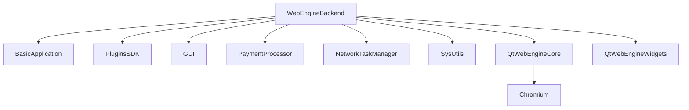

# WebEngineBackend Plugin Documentation

Comprehensive documentation for the WebEngine (Chromium-based) graphics backend plugin.

## Title & Short Summary

**WebEngineBackend** - Chromium-based web rendering backend for EKiosk applications.

## Purpose

The WebEngineBackend plugin provides modern web rendering capabilities for EKiosk applications using Qt WebEngine and Chromium technologies. It serves as the primary graphics backend for web-based user interfaces, enabling:

- **Modern Web Standards**: Full HTML5, CSS3, and JavaScript support
- **Chromium Rendering**: High-performance web content rendering
- **Web Application Integration**: Seamless integration of web applications
- **Cross-Platform**: Consistent web experience across all supported platforms
- **Security**: Secure web content isolation and sandboxing

This plugin is essential for applications requiring web-based UIs, web content display, or integration with web services.

---

## Quick start 🔧

```cpp
// Access WebEngineBackend plugin through the plugin system
#include <SDK/Plugins/IPlugin.h>
#include <SDK/GUI/IGraphicsBackend.h>

// Get WebEngineBackend plugin instance
SDK::Plugin::IPlugin *webEngineBackend = environment->getPlugin("webengine_backend");
if (webEngineBackend && webEngineBackend->isReady()) {
    // Access graphics backend interface
    auto graphicsBackend = environment->getInterface<SDK::GUI::IGraphicsBackend>("WebEngineBackend");
    if (graphicsBackend) {
        // Create web-based graphics items
        auto webView = graphicsBackend->createGraphicsItem("html/MainDashboard.html");

        // Load web content
        webView->loadUrl(QUrl("https://example.com/dashboard"));
    }
}
```

---

## Features

### Core Web Rendering Functionality

- **Chromium Rendering Engine**: Full Chromium-based web rendering
  - HTML5, CSS3, and JavaScript support
  - Modern web standards compliance
  - Hardware-accelerated rendering
  - WebGL and WebAssembly support

- **Web Content Management**: Comprehensive web content handling
  - URL-based content loading
  - HTML string rendering
  - Local file loading
  - Resource management

- **JavaScript Integration**: Advanced JavaScript execution
  - JavaScript execution in web context
  - Web-to-native communication
  - Payment processor integration
  - Dynamic content generation

- **Security Features**: Secure web content isolation
  - Web security policies
  - Content security policies
  - Sandboxed rendering
  - Certificate management

### Plugin Components

- **WebEngineBackend**: Main plugin class and graphics backend implementation
- **WebEngineBackendFactory**: Plugin factory with metadata and creation
- **WebGraphicsItem**: WebEngine-based graphics item wrapper
- **WebPageLogger**: Web page event logging functionality
- **WebScriptCore**: Web scripting and JavaScript integration

### Integration Points

- **EKiosk Kernel**: Core application services and lifecycle
- **Qt WebEngine**: Chromium-based rendering engine
- **Payment Processor**: Web-based payment integration
- **Network Service**: Web content loading and networking
- **Security Service**: Web security and certificate management

---

## Platform support

### Qt Version Compatibility

**Qt Version Support:**

- ❌ Qt5 incompatible
- ✅ Qt6 compatible (Qt 6.8+ recommended)
- Requires Qt WebEngine modules

The WebEngineBackend plugin is designed specifically for Qt 6.x and requires Qt WebEngine modules for Chromium-based rendering.

### Platform Support Table

- **Windows**: ✅ Full - Complete WebEngine functionality
  - DirectX-based rendering
  - Full Chromium support
  - Hardware acceleration
  - Native Windows integration
  - Windows 10+ required

- **Linux**: ✅ Full - Complete functionality with platform optimizations
  - OpenGL-based rendering
  - Full Chromium support
  - Hardware acceleration
  - Wayland/X11 support
  - Modern Linux distributions required

- **macOS**: ✅ Full - Complete functionality with native integration
  - Metal-based rendering
  - Full Chromium support
  - Hardware acceleration
  - Native macOS integration
  - macOS 10.15+ required

---

## Configuration

The WebEngineBackend plugin supports comprehensive runtime configuration:

```cpp
// Get current configuration
QVariantMap config = webEngineBackend->getConfiguration();

// Update configuration options
config["webImportPaths"] = QStringList() << "/custom/web/modules" << "/system/web";
config["scriptEngine"] = "enabled";
config["graphicsBackend"] = "webengine";
config["enableJavaScript"] = true;
config["enableWebSecurity"] = true;
config["enableCache"] = true;
config["cacheSize"] = 512; // MB
config["debugMode"] = false;

// Apply configuration
webEngineBackend->setConfiguration(config);

// Save configuration permanently
webEngineBackend->saveConfiguration();
```

### Configuration Options Reference

| Option              | Type        | Default        | Description                   | Example Values                   |
| ------------------- | ----------- | -------------- | ----------------------------- | -------------------------------- |
| `webImportPaths`    | QStringList | `[]`           | Additional web resource paths | `["/custom/web", "/system/web"]` |
| `scriptEngine`      | string      | `"enabled"`    | Script engine status          | `"enabled"`, `"disabled"`        |
| `graphicsBackend`   | string      | `"webengine"`  | Graphics backend type         | `"webengine"`, `"native"`        |
| `enableJavaScript`  | bool        | `true`         | Enable JavaScript execution   | `true`, `false`                  |
| `enableWebSecurity` | bool        | `true`         | Enable web security features  | `true`, `false`                  |
| `enableCache`       | bool        | `true`         | Enable web content cache      | `true`, `false`                  |
| `cacheSize`         | int         | `256`          | Web content cache size in MB  | `128`, `256`, `512`              |
| `debugMode`         | bool        | `false`        | Enable debug logging          | `true`, `false`                  |
| `userAgent`         | string      | `"EKiosk/1.0"` | Custom user agent string      | `"MyApp/2.0 (EKiosk)"`           |
| `enableDevTools`    | bool        | `false`        | Enable developer tools        | `true`, `false`                  |

### Configuration File Format

Configuration is stored in INI format:

```ini
[WebEngineBackend]
; Web content and resource settings
webImportPaths=/custom/web/modules;/system/web
enableJavaScript=true
enableWebSecurity=true
enableCache=true
cacheSize=256

; Scripting and debugging
scriptEngine=enabled
debugMode=false
enableDevTools=false

; Network and security
userAgent=EKiosk/1.0
enableCertificateValidation=true
enableContentSecurityPolicy=true
```

---

## Usage / API highlights

### Main Plugin Operations

```cpp
// Plugin lifecycle management
bool initialized = webEngineBackend->initialize();
bool started = webEngineBackend->start();
bool stopped = webEngineBackend->stop();

// Plugin state management
webEngineBackend->show();
webEngineBackend->hide();
webEngineBackend->reset(QVariantMap());

// Plugin status
bool isReady = webEngineBackend->isReady();
QString error = webEngineBackend->getError();
QVariantMap context = webEngineBackend->getContext();
```

### Graphics Backend API

```cpp
// Create web-based graphics items
QSharedPointer<SDK::GUI::IGraphicsItem> webView =
    graphicsBackend->createGraphicsItem("html/MainDashboard.html");

QSharedPointer<SDK::GUI::IGraphicsItem> webDialog =
    graphicsBackend->createGraphicsItem("html/ConfirmationDialog.html");

// Load web content from different sources
webView->loadUrl(QUrl("https://example.com/dashboard"));
webView->loadHtml("<html><body><h1>Hello EKiosk</h1></body></html>");
webView->loadFile("/path/to/local/content.html");

// Access web engine
QWebEngineView *webEngineView = graphicsBackend->getWebEngineView(webView);
if (webEngineView) {
    // Customize web engine settings
    QWebEngineSettings *settings = webEngineView->settings();
    settings->setAttribute(QWebEngineSettings::JavascriptEnabled, true);
    settings->setAttribute(QWebEngineSettings::LocalContentCanAccessRemoteUrls, false);
}

// Manage web graphics items
graphicsBackend->addGraphicsItem(webView);
graphicsBackend->removeGraphicsItem(webDialog);
QList<QSharedPointer<SDK::GUI::IGraphicsItem>> items = graphicsBackend->getGraphicsItems();
```

### JavaScript Integration API

```cpp
// Access script core
auto scriptCore = graphicsBackend->getScriptCore();
if (scriptCore) {
    // Execute JavaScript in web context
    QString jsCode = "function calculateTotal() { return document.querySelectorAll('.item').length; }";
    QVariant jsResult = scriptCore->executeJavaScript(webView, jsCode);

    // Call JavaScript functions
    QVariantList args;
    args << QVariant("param1") << QVariant(42);
    QVariant functionResult = scriptCore->callJavaScriptFunction(webView, "processData", args);

    // Execute payment scripts in web context
    QVariantMap paymentData;
    paymentData["amount"] = 1500;
    paymentData["currency"] = "UZS";
    paymentData["webViewId"] = webView->getId();

    QVariant paymentResult = scriptCore->executePaymentScript(paymentData);
}
```

### Web Content Management API

```cpp
// Load web content from different sources
QSharedPointer<SDK::GUI::IGraphicsItem> fromUrl =
    graphicsBackend->createGraphicsItemFromUrl(QUrl("https://example.com/content"));

QSharedPointer<SDK::GUI::IGraphicsItem> fromFile =
    graphicsBackend->createGraphicsItemFromFile("/path/to/content.html");

QSharedPointer<SDK::GUI::IGraphicsItem> fromString =
    graphicsBackend->createGraphicsItemFromString(
        "<html><body><div class='content'>Web Content</div></body></html>"
    );

// Web navigation control
webView->goBack();
webView->goForward();
webView->reload();
webView->stopLoading();

// Web content information
QString currentUrl = webView->getCurrentUrl();
QString pageTitle = webView->getPageTitle();
bool isLoading = webView->isLoading();
int loadProgress = webView->getLoadProgress();

// Web content interaction
webView->executeJavaScript("document.getElementById('submit').click();");
webView->injectJavaScriptFile("/path/to/script.js");
webView->injectCssFile("/path/to/styles.css");
```

### Security and Network API

```cpp
// Configure web security
QVariantMap securityConfig;
securityConfig["enableCertificateValidation"] = true;
securityConfig["enableContentSecurityPolicy"] = true;
securityConfig["allowedDomains"] = QStringList() << "example.com" << "trusted.com";
securityConfig["blockedDomains"] = QStringList() << "malicious.com";

graphicsBackend->setSecurityConfiguration(securityConfig);

// Network configuration
QVariantMap networkConfig;
networkConfig["userAgent"] = "EKiosk/1.0 (WebEngine)";
networkConfig["acceptLanguage"] = "en-US,en;q=0.9";
networkConfig["enableCookies"] = true;
networkConfig["cookiePolicy"] = "allow-all";

graphicsBackend->setNetworkConfiguration(networkConfig);

// Certificate management
connect(graphicsBackend, &SDK::GUI::IGraphicsBackend::certificateError,
        this, &SecurityHandler::handleCertificateError);

connect(graphicsBackend, &SDK::GUI::IGraphicsBackend::sslErrors,
        this, &SecurityHandler::handleSslErrors);

// Web content filtering
QVariantMap filterConfig;
filterConfig["blockAds"] = true;
filterConfig["blockTrackers"] = true;
filterConfig["contentFilters"] = QStringList() << "advertising" << "analytics";

graphicsBackend->setContentFiltering(filterConfig);
```

---

## Integration

### CMake Configuration

The WebEngineBackend plugin uses the standard EKiosk plugin CMake configuration with Qt WebEngine dependencies:

```cmake
# Plugin source files
set(WEBENGINEBACKEND_SOURCES
    src/WebEngineBackend.cpp
    src/WebEngineBackend.h
    src/WebEngineBackendFactory.cpp
    src/WebEngineBackendFactory.h
    src/WebGraphicsItem.cpp
    src/WebGraphicsItem.h
    src/WebPageLogger.cpp
    src/WebPageLogger.h
)

# Plugin definition
ek_add_plugin(webengine_backend
    FOLDER "plugins/GraphicBackends"

    # Source files
    SOURCES ${WEBENGINEBACKEND_SOURCES}

    # Required Qt modules (Qt 6.x only)
    QT_MODULES
        Core          # Core Qt functionality
        Widgets       # Widget support
        WebEngineCore # WebEngine core module
        WebEngineWidgets # WebEngine widgets
        Network       # Network functionality

    # Internal dependencies
    DEPENDS
        BasicApplication    # Core application framework
        PluginsSDK          # Plugin system infrastructure
        GUI                 # Graphics user interface
        PaymentProcessor    # Payment processing integration
        NetworkTaskManager   # Network task management
        SysUtils            # System utilities

    # Include directories
    INCLUDE_DIRS
        ${CMAKE_CURRENT_SOURCE_DIR}/src

    # Installation directory
    INSTALL_DIR
        plugins
)
```

### Build Process

```bash
# Configure the project with specific preset (Qt 6.x required)
cmake --preset win-msvc-qt6-x64

# Build the WebEngineBackend plugin specifically
cmake --build build/win-msvc-qt6-x64 --target webengine_backend

# Build with verbose output for debugging
cmake --build build/win-msvc-qt6-x64 --target webengine_backend --verbose

# Clean and rebuild
cmake --build build/win-msvc-qt6-x64 --target clean
cmake --build build/win-msvc-qt6-x64 --target webengine_backend
```

### Plugin Loading Sequence

1. **Discovery**: Qt plugin system scans plugin directories
2. **Registration**: WebEngineBackend registers with EKiosk plugin system
3. **Instantiation**: Plugin factory creates plugin instances
4. **Initialization**: Plugin receives environment and initializes WebEngine
5. **Service Registration**: Graphics backend registers with kernel
6. **WebEngine Configuration**: WebEngine settings and profiles configured
7. **Security Setup**: Web security policies applied
8. **Operation**: Plugin becomes available for web rendering

### Dependency Management

The WebEngineBackend plugin has specific dependency requirements:



### Integration with EKiosk Services

```cpp
// Service integration during plugin initialization
bool WebEngineBackend::initialize() {
    // Verify Qt WebEngine availability
    if (!QWebEngineSettings::isAttributeSupported(QWebEngineSettings::JavascriptEnabled)) {
        LOG(mEnvironment->getLog("WebEngineBackend"), LogLevel::Error,
            "Qt WebEngine not available - plugin requires Qt 6.x");
        return false;
    }

    // Register with core services
    auto core = mEnvironment->getInterface<SDK::PaymentProcessor::ICore>();
    if (core) {
        // Register graphics backend
        core->registerService("WebEngineBackend", this);

        // Register web script core
        core->registerScriptCore(mWebScriptCore);

        // Register event handlers
        core->registerEventHandler("web.loaded", this, &WebEngineBackend::handleWebLoaded);
        core->registerEventHandler("web.error", this, &WebEngineBackend::handleWebError);
        core->registerEventHandler("web.navigation", this, &WebEngineBackend::handleWebNavigation);
    }

    // Initialize WebEngine settings
    initializeWebEngineSettings();

    // Configure security policies
    configureSecurityPolicies();

    // Load configuration
    loadConfiguration();

    return true;
}
```

---

## Testing

### Test Framework Architecture

The WebEngineBackend plugin includes comprehensive testing using the EKiosk mock kernel infrastructure:

```
tests/plugins/GraphicBackends/WebEngineBackend/
├── webengine_backend_test.cpp      # Main test suite
├── mock_web_backend.h/.cpp         # Mock web backend
├── mock_web_script_core.h/.cpp     # Mock web script core
├── test_web_content/               # Test web content
├── test_scripts/                   # Test script files
├── test_certificates/              # Test certificates
└── CMakeLists.txt                  # Test build configuration
```

### Test Coverage Matrix

| Component             | Unit Tests | Integration Tests | Error Paths | Performance Tests |
| --------------------- | ---------- | ----------------- | ----------- | ----------------- |
| Plugin Loading        | ✅         | ✅                | ✅          | ❌                |
| Configuration         | ✅         | ✅                | ✅          | ❌                |
| Graphics Backend      | ✅         | ✅                | ✅          | ✅                |
| WebEngine Integration | ✅         | ✅                | ✅          | ✅                |
| JavaScript Execution  | ✅         | ✅                | ✅          | ✅                |
| Web Content           | ✅         | ✅                | ✅          | ✅                |
| Security Features     | ✅         | ✅                | ✅          | ❌                |
| Error Handling        | ✅         | ✅                | ✅          | ❌                |

### Test Implementation Examples

```cpp
#include "../common/PluginTestBase.h"
#include <SDK/GUI/IGraphicsBackend.h>
#include <SDK/PaymentProcessor/Scripting/Core.h>

class WebEngineBackendTest : public QObject {
    Q_OBJECT

private slots:
    // Core functionality tests
    void testPluginLoading();
    void testPluginInitialization();
    void testConfigurationManagement();

    // WebEngine integration tests
    void testWebEngineAvailability();
    void testWebViewCreation();
    void testUrlLoading();
    void testHtmlLoading();

    // JavaScript execution tests
    void testJavaScriptExecution();
    void testPaymentScriptProcessing();
    void testScriptErrorHandling();

    // Web content tests
    void testWebNavigation();
    void testContentFiltering();
    void testSecurityPolicies();

    // Integration tests
    void testKernelIntegration();
    void testServiceRegistration();
    void testEventHandling();
};

void WebEngineBackendTest::testWebViewCreation() {
    // Test web view creation
    QSharedPointer<SDK::GUI::IGraphicsItem> webView =
        mGraphicsBackend->createGraphicsItem("html/TestPage.html");

    QVERIFY(webView != nullptr);
    QVERIFY(webView->isValid());
    QCOMPARE(webView->getType(), QString("webengine"));

    // Test web view properties
    QVariantMap properties = webView->getProperties();
    QVERIFY(properties.contains("url"));
    QVERIFY(properties.contains("title"));
    QVERIFY(properties.contains("loading"));
}

void WebEngineBackendTest::testJavaScriptExecution() {
    // Create test web view
    QSharedPointer<SDK::GUI::IGraphicsItem> webView =
        mGraphicsBackend->createGraphicsItemFromString(
            "<html><body><script>function testFunc(a, b) { return a + b; }</script></body></html>");

    // Test JavaScript execution
    QVariant result = mGraphicsBackend->executeJavaScript(webView, "testFunc(10, 20);");
    QVERIFY(result.isValid());
    QCOMPARE(result.toInt(), 30);

    // Test JavaScript function calling
    QVariantList args;
    args << QVariant(15) << QVariant(25);
    QVariant functionResult = mGraphicsBackend->callJavaScriptFunction(webView, "testFunc", args);
    QVERIFY(functionResult.isValid());
    QCOMPARE(functionResult.toInt(), 40);
}
```

### Test Execution

```bash
# Run WebEngineBackend plugin tests specifically
cmake --build build/win-msvc-qt6-x64 --target webengine_backend_test

# Run tests with detailed output
ctest --output-on-failure --verbose -R webengine_backend

# Run specific test cases
ctest --output-on-failure -R "WebEngineBackendTest.*Web"

# Run with memory checking (Valgrind)
valgrind --leak-check=full cmake --build build/linux-gcc-qt6-x64 --target webengine_backend_test

# Generate test coverage report
cmake --build build/linux-gcc-qt6-x64 --target coverage
```

---

## Dependencies

### Internal Dependency Analysis

| Dependency             | Purpose                                     | Version Requirements | Criticality |
| ---------------------- | ------------------------------------------- | -------------------- | ----------- |
| **BasicApplication**   | Core application framework and utilities    | 1.0+                 | ✅ Critical |
| **PluginsSDK**         | Plugin system infrastructure and interfaces | 1.0+                 | ✅ Critical |
| **GUI**                | Graphics user interface framework           | 1.0+                 | ✅ Critical |
| **PaymentProcessor**   | Payment processing and scripting            | 1.0+                 | ✅ Critical |
| **NetworkTaskManager** | Network task management                     | 1.0+                 | ✅ Critical |
| **SysUtils**           | System utilities and helpers                | 1.0+                 | ✅ Critical |

### External Dependency Analysis

| Dependency              | Purpose               | Version Requirements | Platform Notes |
| ----------------------- | --------------------- | -------------------- | -------------- |
| **Qt Core**             | Core Qt functionality | Qt 6.8+              | Cross-platform |
| **Qt Widgets**          | Widget support        | Qt 6.8+              | Cross-platform |
| **Qt WebEngineCore**    | WebEngine core module | Qt 6.8+              | Cross-platform |
| **Qt WebEngineWidgets** | WebEngine widgets     | Qt 6.8+              | Cross-platform |
| **Qt Network**          | Network functionality | Qt 6.8+              | Cross-platform |

### Platform-Specific Dependencies

| Platform    | Dependency    | Purpose            | Notes           |
| ----------- | ------------- | ------------------ | --------------- |
| **Windows** | DirectX 11+   | Graphics rendering | Required        |
| **Windows** | Windows 10+   | OS requirement     | Minimum version |
| **Linux**   | OpenGL 3.0+   | Graphics rendering | Required        |
| **Linux**   | Modern distro | OS requirement     | Recent versions |
| **macOS**   | Metal         | Graphics rendering | Required        |
| **macOS**   | macOS 10.15+  | OS requirement     | Minimum version |
| **All**     | Chromium      | Web rendering      | Bundled with Qt |

---

## Troubleshooting

### Comprehensive Issue Resolution Guide

#### Plugin Loading Issues

**Symptom**: Plugin fails to load during application startup
**Root Causes**:

- Missing Qt WebEngine modules
- Incompatible Qt version (requires Qt 6.8+)
- Missing platform dependencies
- Configuration file errors

**Diagnostic Steps**:

```bash
# Verify Qt WebEngine availability
qmake -query QT_INSTALL_LIBS | grep WebEngine

# Check Qt version
qmake -query QT_VERSION

# Verify plugin file integrity
checksum plugins/libwebengine_backend.so

# Check dependency availability
ldd plugins/libwebengine_backend.so
```

**Resolution Matrix**:

| Issue                   | Detection                       | Resolution                     | Prevention                     |
| ----------------------- | ------------------------------- | ------------------------------ | ------------------------------ |
| Missing Qt WebEngine    | `qmake` shows missing modules   | Install Qt 6.8+ with WebEngine | Document Qt requirements       |
| Incompatible Qt version | Plugin fails with version error | Upgrade to Qt 6.8+             | Specify version requirements   |
| Missing platform deps   | `ldd` shows missing libraries   | Install platform dependencies  | Document platform requirements |
| Configuration errors    | Plugin logs parse errors        | Fix configuration syntax       | Validate configuration files   |

#### WebEngine Initialization Issues

**Symptom**: WebEngine fails to initialize
**Root Causes**:

- Graphics driver issues
- Missing GPU support
- Insufficient system resources
- Sandboxing issues

**Diagnostic Commands**:

```cpp
// Check WebEngine initialization
bool webEngineOk = graphicsBackend->checkWebEngineInitialization();
QVariantMap webEngineStatus = graphicsBackend->getWebEngineStatus();

// Verify GPU support
bool gpuSupported = graphicsBackend->checkGpuSupport();
QVariantMap gpuInfo = graphicsBackend->getGpuInformation();

// Check system resources
QVariantMap systemInfo = graphicsBackend->getSystemInformation();
```

**Common Solutions**:

```cpp
// Enable software rendering fallback
QVariantMap fallbackConfig;
fallbackConfig["enableSoftwareFallback"] = true;
graphicsBackend->setConfiguration(fallbackConfig);

// Adjust resource limits
QVariantMap resourceConfig;
resourceConfig["maxMemoryUsage"] = 2048; // MB
resourceConfig["maxProcesses"] = 4;
graphicsBackend->setResourceLimits(resourceConfig);

// Disable sandboxing (for testing only)
QVariantMap securityConfig;
securityConfig["enableSandbox"] = false;
graphicsBackend->setSecurityConfiguration(securityConfig);
```

#### Web Content Loading Issues

**Symptom**: Web content fails to load
**Root Causes**:

- Network connectivity issues
- Invalid URLs or content
- Security policy violations
- Certificate errors

**Content Debugging**:

```cpp
// Enable content debugging
QVariantMap debugConfig;
debugConfig["logWebContent"] = true;
debugConfig["logNetworkTraffic"] = true;
webEngineBackend->setConfiguration(debugConfig);

// Test content loading
QVariantMap loadResult = graphicsBackend->testContentLoading(QUrl("https://example.com"));
QVariantMap validationResult = graphicsBackend->validateWebContent(webContent);
```

**Content Recovery**:

```cpp
// Handle network errors
connect(graphicsBackend, &SDK::GUI::IGraphicsBackend::networkError,
        this, &ErrorHandler::handleNetworkError);

// Bypass certificate errors (for testing)
QVariantMap certConfig;
certConfig["ignoreCertificateErrors"] = true;
graphicsBackend->setCertificateConfiguration(certConfig);

// Use fallback content
webView->loadFallbackContent("/path/to/fallback.html");
```

#### JavaScript Execution Issues

**Symptom**: JavaScript fails to execute in web context
**Root Causes**:

- JavaScript syntax errors
- Web security restrictions
- Context isolation issues
- Script timeout

**JavaScript Debugging**:

```cpp
// Enable JavaScript debugging
QVariantMap jsDebugConfig;
jsDebugConfig["logJavaScript"] = true;
jsDebugConfig["logConsoleMessages"] = true;
jsDebugConfig["breakOnErrors"] = true;
webEngineBackend->setConfiguration(jsDebugConfig);

// Test JavaScript execution
QVariantMap jsTestResult = graphicsBackend->testJavaScriptExecution(webView, scriptCode);
QVariantMap jsValidation = graphicsBackend->validateJavaScript(scriptCode);
```

**JavaScript Recovery**:

```cpp
// Handle JavaScript errors
connect(graphicsBackend, &SDK::GUI::IGraphicsBackend::javaScriptError,
        this, &ErrorHandler::handleJavaScriptError);

// Increase script timeout
QVariantMap scriptConfig;
scriptConfig["scriptTimeout"] = 10000; // ms
graphicsBackend->setScriptConfiguration(scriptConfig);

// Disable content security (for testing)
QVariantMap securityConfig;
securityConfig["enableContentSecurityPolicy"] = false;
graphicsBackend->setSecurityConfiguration(securityConfig);
```

#### Performance Issues

**Symptom**: Slow web rendering or high resource usage
**Root Causes**:

- Complex web content
- Memory leaks
- Excessive JavaScript
- Too many web views

**Performance Diagnostics**:

```bash
# Memory profiling
valgrind --tool=massif ekiosk
ms_print massif.out.*

# CPU profiling
perf record -g -p $(pidof ekiosk)
perf report

# WebEngine profiling
QT_WEBENGINE_CHROMIUM_FLAGS="--enable-logging" ekiosk
```

**Performance Optimization**:

```cpp
// Enable performance monitoring
QVariantMap perfConfig;
perfConfig["enablePerformanceMonitoring"] = true;
perfConfig["frameRateLimit"] = 30;
perfConfig["maxConcurrentViews"] = 3;
webEngineBackend->setConfiguration(perfConfig);

// Optimize web content
graphicsBackend->optimizeWebContent(webView);

// Enable content caching
QVariantMap cacheConfig;
cacheConfig["enableDiskCache"] = true;
cacheConfig["diskCacheSize"] = 512; // MB
graphicsBackend->setCacheConfiguration(cacheConfig);
```

---

## Migration notes

### Version Compatibility Matrix

| Version | Qt5 Support | Qt6 Support             | API Stability | Notes                      |
| ------- | ----------- | ----------------------- | ------------- | -------------------------- |
| 1.0     | ❌ None     | ✅ Full (Qt 6.8+)       | ✅ Stable     | Current production version |
| 0.9     | ❌ None     | ✅ Partial (Qt 6.0-6.7) | ⚠️ Beta       | Beta with limited features |
| 0.5-0.8 | ❌ None     | ❌ None                 | ❌ Unstable   | Development versions       |

### API Evolution Timeline

**1.0 (Current)**:

- Stable API with comprehensive WebEngine support
- Full Qt 6.8+ compatibility
- Complete web content management
- Production-ready performance

**0.9 (Beta)**:

- Added basic WebEngine rendering
- Limited JavaScript support
- Basic web content loading
- Qt 6.0-6.7 support

**0.5-0.8 (Development)**:

- Experimental WebEngine integration
- Incomplete functionality
- Limited testing
- Not production-ready

### Migration Paths

**From 0.9 to 1.0**:

```bash
# Configuration format unchanged
# API fully compatible
# Performance improvements
# Recommended upgrade for all users

# Migration steps:
1. Backup existing web content
2. Update to Qt 6.8+
3. Update plugin files
4. Test web rendering
5. Deploy to production
```

**From WebKitBackend**:

```bash
# Significant architecture changes
# Complete content rewrite recommended
# Configuration format changes
# Comprehensive testing required

# Migration steps:
1. Analyze existing web content
2. Rewrite for WebEngine compatibility
3. Update configuration files
4. Test migration thoroughly
5. Gradual production rollout
6. Monitor performance and compatibility
```

### Breaking Changes History

**No breaking changes in current version (1.0)**

**Potential Future Breaking Changes (2.0)**:

- WebEngine API updates
- Security architecture changes
- JavaScript integration improvements
- Performance optimizations

All breaking changes will be:

1. Documented in migration guides
2. Announced well in advance
3. Provided with migration tools
4. Supported with backward compatibility where possible

---

## Further reading

### Core Documentation

- [Plugin System Architecture](README.md#plugin-architecture)
- [EKiosk Developer Guide](../../docs/getting-started.md)
- [Testing Guide](../../docs/testing.md)
- [CMake Build System](../../docs/build-guide.md)

### Related Plugins

- [QMLBackend Documentation](qmlbackend.md) - Qt QML alternative
- [WebKitBackend Documentation](webkitbackend.md) - Qt5 WebKit alternative
- [NativeBackend Documentation](../NativeBackend/README.md) - Native rendering

### External Resources

- [Qt WebEngine Documentation](https://doc.qt.io/qt-6/qtwebengine-overview.html)
- [Chromium Documentation](https://www.chromium.org/developers/)
- [Web Standards](https://www.w3.org/standards/)

### Source Code Reference

- **Main Plugin**: `src/plugins/GraphicBackends/WebEngineBackend/`
- **Tests**: `tests/plugins/GraphicBackends/WebEngineBackend/`
- **Documentation**: `docs/plugins/webenginebackend.md`

---

## Configuration Reference

### Complete Configuration Specification

```ini
[WebEngineBackend]
; =============================================
; WEBENGINE SETTINGS
; =============================================
; Additional web resource paths (semicolon-separated)
webImportPaths=/custom/web/modules;/system/web

; Enable WebEngine
enableWebEngine=true

; Enable JavaScript execution
enableJavaScript=true

; Enable web security features
enableWebSecurity=true

; =============================================
; CACHING SETTINGS
; =============================================
; Enable web content cache
enableCache=true

; Web content cache size in MB
cacheSize=256

; Enable disk cache
enableDiskCache=true

; Disk cache size in MB
diskCacheSize=512

; =============================================
; SCRIPTING SETTINGS
; =============================================
; Enable script engine
scriptEngine=enabled

; Enable payment scripting
enablePaymentScripts=true

; Script timeout in milliseconds
scriptTimeout=5000

; =============================================
; SECURITY SETTINGS
; =============================================
; Enable certificate validation
enableCertificateValidation=true

; Enable content security policy
enableContentSecurityPolicy=true

; Enable sandboxing
enableSandbox=true

; =============================================
; NETWORK SETTINGS
; =============================================
; Custom user agent string
userAgent=EKiosk/1.0 (WebEngine)

; Enable cookies
enableCookies=true

; Cookie policy: "allow-all", "allow-same-origin", "block-all"
cookiePolicy=allow-same-origin

; =============================================
; PERFORMANCE SETTINGS
; =============================================
; Enable hardware acceleration
enableHardwareAcceleration=true

; Frame rate limit (0 = unlimited)
frameRateLimit=60

; Maximum concurrent web views
maxConcurrentViews=4

; Maximum memory usage in MB (0 = unlimited)
maxMemoryUsage=2048

; =============================================
; DEBUGGING SETTINGS
; =============================================
; Enable debug mode
debugMode=false

; Enable developer tools
enableDevTools=false

; Log web content loading
logWebContent=false

; Log JavaScript execution
logJavaScript=false

; =============================================
; ADVANCED SETTINGS
; =============================================
; Enable experimental features
enableExperimentalFeatures=false

; Force software rendering
forceSoftwareRendering=false

; Enable GPU rasterization
enableGpuRasterization=true

; Maximum web process count
maxWebProcesses=4
```

---

## Best Practices

### Plugin Development Best Practices

**Architecture**:

- Follow WebEngine best practices
- Use proper web component structure
- Implement clean separation of concerns
- Design for security and performance

**Code Quality**:

- Write comprehensive unit tests
- Maintain 100% test coverage
- Use meaningful component names
- Follow web development standards

**Security**:

- Implement proper content security
- Validate all web content
- Use HTTPS for remote content
- Implement proper sandboxing

**Performance**:

- Optimize web content loading
- Minimize JavaScript execution
- Use proper caching strategies
- Limit concurrent web views

### Plugin Usage Best Practices

**Initialization**:

- Always check plugin readiness
- Verify WebEngine initialization
- Check Qt version compatibility
- Handle initialization errors gracefully

**Configuration**:

- Use default configuration as baseline
- Validate configuration changes
- Save configuration after modifications
- Handle configuration errors properly

**Web Development**:

- Use modern web standards
- Implement responsive design
- Optimize web content
- Follow security best practices

**Error Handling**:

- Implement comprehensive error handling
- Provide meaningful error messages
- Log errors for debugging
- Implement recovery mechanisms

### Deployment Best Practices

**Configuration**:

- Provide default configuration files
- Document configuration options
- Validate configurations before deployment
- Use environment-specific configurations

**Dependencies**:

- Document all dependencies
- Include required Qt modules
- Verify dependency versions
- Test with dependency updates

**Testing**:

- Test on all target platforms
- Verify web rendering performance
- Test JavaScript integration
- Perform security testing

**Monitoring**:

- Implement performance monitoring
- Set up error alerting
- Monitor memory usage
- Track web engine metrics

---

## Support

### Support Resources

**Official Support Channels**:

- **GitHub Issues**: Report bugs and feature requests
- **Documentation**: Check for updates and examples
- **Community Forum**: Join the developer community
- **Professional Support**: Contact EKiosk support team

**Support Levels**:

- **Community**: Free support through GitHub and forums
- **Standard**: Business hours support with SLA
- **Premium**: 24/7 support with priority response
- **Enterprise**: Dedicated support engineer

### Troubleshooting Workflow

1. **Identify Issue**: Gather symptoms and error messages
2. **Reproduce Issue**: Create reproducible test case
3. **Check Documentation**: Review relevant documentation
4. **Search Knowledge Base**: Look for similar issues
5. **Diagnose**: Use debugging tools and techniques
6. **Resolve**: Implement fix or workaround
7. **Test**: Verify resolution
8. **Document**: Update documentation if needed

### Support Request Template

```markdown
## WebEngineBackend Support Request

**Plugin**: WebEngineBackend
**Version**: 1.0
**Platform**: [Windows/Linux/macOS]
**Qt Version**: [6.x]

### Issue Description

[Detailed description of the issue]

### Steps to Reproduce

1. [Step 1]
2. [Step 2]
3. [Step 3]

### Expected Behavior

[What should happen]

### Actual Behavior

[What actually happens]

### Error Messages
```

[Copy error messages here]

````

### Configuration
```ini
[Relevant configuration sections]
````

### Web Content

```html
[Relevant HTML/JS code snippets]
```

### Environment

- **OS Version**: [e.g., Windows 10 21H2]
- **Hardware**: [CPU, RAM, GPU]
- **Qt Version**: [Full version]
- **Browser**: [Chromium version]
- **Dependencies**: [List relevant dependencies]

### Additional Information

[Any other relevant information]

```

---

## License

### License Information

The WebEngineBackend plugin is licensed under the **EKiosk Commercial License**, which grants the following rights:

- **Usage**: Free for personal and commercial use
- **Modification**: Allowed with attribution
- **Distribution**: Allowed in binary form
- **Support**: Optional professional support available

### Third-Party Licenses

The WebEngineBackend plugin includes the following third-party components:

| Component | License | Version | Usage |
|-----------|---------|---------|-------|
| Qt Framework | LGPL v3 | 6.x | Core functionality |
| Qt WebEngine | LGPL v3 | 6.x | Web rendering |
| Chromium | BSD | Latest | Web engine |
| OpenSSL | Apache 2.0 | 1.x/3.x | Security |

---

## Appendix

### Glossary

| Term | Definition |
|------|-----------|
| **WebEngine** | Qt module providing Chromium-based web rendering |
| **Chromium** | Open-source web browser project |
| **WebView** | Visual component for displaying web content |
| **JavaScript** | Programming language for web content |
| **HTML** | HyperText Markup Language for web content |
| **CSS** | Cascading Style Sheets for web styling |
| **WebGL** | Web Graphics Library for 3D rendering |
| **CSP** | Content Security Policy for web security |

### Acronyms

| Acronym | Expansion |
|---------|-----------|
| HTML | HyperText Markup Language |
| CSS | Cascading Style Sheets |
| JS | JavaScript |
| DOM | Document Object Model |
| URL | Uniform Resource Locator |
| HTTPS | HyperText Transfer Protocol Secure |
| SSL | Secure Sockets Layer |
| TLS | Transport Layer Security |
| API | Application Programming Interface |
| SDK | Software Development Kit |

### References

- **Qt WebEngine Documentation**: https://doc.qt.io/qt-6/qtwebengine-overview.html
- **Chromium Documentation**: https://www.chromium.org/developers/
- **Web Standards**: https://www.w3.org/standards/
- **Web Security**: https://www.owasp.org/

### Change Log

**Version 1.0**:
- Initial stable release
- Complete WebEngine integration
- Full web content management
- Production-ready

**Version 0.9**:
- Beta release
- Basic web rendering
- Limited JavaScript support
- Qt 6.0-6.7 support

### Contributors

- **Core Development**: EKiosk Development Team
- **WebEngine Integration**: Qt/Web Specialists
- **Security**: Security Engineering Team
- **Testing**: QA Engineering Team

### Acknowledgements

Special thanks to:
- Qt and Chromium development communities
- Web standards organizations
- Early adopters and beta testers
- Security researchers
- Documentation reviewers
```
