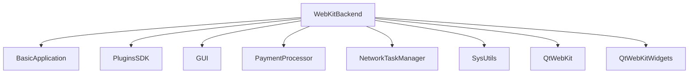

# WebKitBackend Plugin Documentation

Comprehensive documentation for the WebKit (Qt WebKit) graphics backend plugin.

## Title & Short Summary

**WebKitBackend** - Qt WebKit-based graphics rendering backend for EKiosk applications.

## Purpose

The WebKitBackend plugin provides legacy web rendering capabilities for EKiosk applications using Qt WebKit technology. It serves as the primary graphics backend for web-based user interfaces on Qt 5.x platforms, enabling:

- **Legacy Web Standards**: HTML4, CSS2, and JavaScript support
- **Qt WebKit Rendering**: WebKit engine-based rendering
- **Web Application Integration**: Integration of web applications
- **Cross-Platform**: Consistent web experience on supported platforms
- **Qt 5.x Compatibility**: Optimized for Qt 5.x environments

**Important Note**: This plugin is **DEPRECATED** for Qt 6.x. Use WebEngineBackend for Qt 6.x applications.

---

## Quick start 🔧

```cpp
// Access WebKitBackend plugin through the plugin system
#include <SDK/Plugins/IPlugin.h>
#include <SDK/GUI/IGraphicsBackend.h>

// Get WebKitBackend plugin instance
SDK::Plugin::IPlugin *webkitBackend = environment->getPlugin("webkit_backend");
if (webkitBackend && webkitBackend->isReady()) {
    // Access graphics backend interface
    auto graphicsBackend = environment->getInterface<SDK::GUI::IGraphicsBackend>("WebKitBackend");
    if (graphicsBackend) {
        // Create web-based graphics items
        auto webView = graphicsBackend->createGraphicsItem("html/MainDashboard.html");

        // Load web content
        webView->loadUrl(QUrl("https://example.com/dashboard"));
    }
}
```

---

## Features

### Core Web Rendering Functionality

- **Qt WebKit Rendering Engine**: Full WebKit-based web rendering
  - HTML4, CSS2, and JavaScript support
  - Legacy web standards compliance
  - Software-based rendering
  - Basic web technology support

- **Web Content Management**: Comprehensive web content handling
  - URL-based content loading
  - HTML string rendering
  - Local file loading
  - Basic resource management

- **JavaScript Integration**: Basic JavaScript execution
  - JavaScript execution in web context
  - Web-to-native communication
  - Limited payment processor integration
  - Basic dynamic content generation

- **Legacy Features**: Qt 5.x specific features
  - WebKit plugin support
  - Legacy web technologies
  - Qt 5.x compatibility
  - Basic security features

### Plugin Components

- **WebKitBackend**: Main plugin class and graphics backend implementation
- **WebKitBackendFactory**: Plugin factory with metadata and creation
- **WebGraphicsItem**: WebKit-based graphics item wrapper
- **WebPageLogger**: Web page event logging functionality
- **WebScriptCore**: Basic web scripting integration

### Integration Points

- **EKiosk Kernel**: Core application services and lifecycle
- **Qt WebKit**: WebKit-based rendering engine (Qt 5.x)
- **Payment Processor**: Basic web payment integration
- **Network Service**: Web content loading and networking
- **Legacy Systems**: Qt 5.x compatibility layer

---

## Platform support

### Qt Version Compatibility

**Qt Version Support:**

- ✅ Qt5 compatible (Qt 5.0-5.15)
- ❌ Qt6 incompatible
- **DEPRECATED**: Use WebEngineBackend for Qt 6.x

The WebKitBackend plugin is designed specifically for Qt 5.x and is not compatible with Qt 6.x due to WebKit removal.

### Platform Support Table

- **Windows**: ✅ Full - Complete WebKit functionality
  - Software-based rendering
  - Full WebKit support
  - Windows 7+ support
  - Legacy Windows compatibility

- **Linux**: ✅ Full - Complete functionality with platform optimizations
  - Software-based rendering
  - Full WebKit support
  - Legacy Linux compatibility
  - Modern Linux distributions supported

- **macOS**: ❌ Not supported - WebKit deprecated on macOS
  - No official support
  - Not recommended
  - Use WebEngineBackend instead

---

## Configuration

The WebKitBackend plugin supports comprehensive runtime configuration:

```cpp
// Get current configuration
QVariantMap config = webkitBackend->getConfiguration();

// Update configuration options
config["webImportPaths"] = QStringList() << "/custom/web/modules" << "/system/web";
config["scriptEngine"] = "enabled";
config["graphicsBackend"] = "webkit";
config["enableJavaScript"] = true;
config["enablePlugins"] = true;
config["enableCache"] = true;
config["cacheSize"] = 256; // MB
config["debugMode"] = false;

// Apply configuration
webkitBackend->setConfiguration(config);

// Save configuration permanently
webkitBackend->saveConfiguration();
```

### Configuration Options Reference

| Option             | Type        | Default                 | Description                   | Example Values                   |
| ------------------ | ----------- | ----------------------- | ----------------------------- | -------------------------------- |
| `webImportPaths`   | QStringList | `[]`                    | Additional web resource paths | `["/custom/web", "/system/web"]` |
| `scriptEngine`     | string      | `"enabled"`             | Script engine status          | `"enabled"`, `"disabled"`        |
| `graphicsBackend`  | string      | `"webkit"`              | Graphics backend type         | `"webkit"`, `"native"`           |
| `enableJavaScript` | bool        | `true`                  | Enable JavaScript execution   | `true`, `false`                  |
| `enablePlugins`    | bool        | `true`                  | Enable WebKit plugins         | `true`, `false`                  |
| `enableCache`      | bool        | `true`                  | Enable web content cache      | `true`, `false`                  |
| `cacheSize`        | int         | `128`                   | Web content cache size in MB  | `64`, `128`, `256`               |
| `debugMode`        | bool        | `false`                 | Enable debug logging          | `true`, `false`                  |
| `userAgent`        | string      | `"EKiosk/1.0 (WebKit)"` | Custom user agent string      | `"MyApp/2.0 (WebKit)"`           |

### Configuration File Format

Configuration is stored in INI format:

```ini
[WebKitBackend]
; Web content and resource settings
webImportPaths=/custom/web/modules;/system/web
enableJavaScript=true
enablePlugins=true
enableCache=true
cacheSize=128

; Scripting and debugging
scriptEngine=enabled
debugMode=false

; Network settings
userAgent=EKiosk/1.0 (WebKit)
enableCookies=true
```

---

## Usage / API highlights

### Main Plugin Operations

```cpp
// Plugin lifecycle management
bool initialized = webkitBackend->initialize();
bool started = webkitBackend->start();
bool stopped = webkitBackend->stop();

// Plugin state management
webkitBackend->show();
webkitBackend->hide();
webkitBackend->reset(QVariantMap());

// Plugin status
bool isReady = webkitBackend->isReady();
QString error = webkitBackend->getError();
QVariantMap context = webkitBackend->getContext();
```

### Graphics Backend API

```cpp
// Create web-based graphics items
QSharedPointer<SDK::GUI::IGraphicsItem> webView =
    graphicsBackend->createGraphicsItem("html/MainDashboard.html");

QSharedPointer<SDK::GUI::IGraphicsItem> webDialog =
    graphicsBackend->createGraphicsItem("html/ConfirmationDialog.html");

// Load web content from different sources
webView->loadUrl(QUrl("https://example.com/dashboard"));
webView->loadHtml("<html><body><h1>Hello EKiosk</h1></body></html>");
webView->loadFile("/path/to/local/content.html");

// Access web engine
QWebView *webView = graphicsBackend->getWebView(webView);
if (webView) {
    // Customize web settings
    QWebSettings *settings = webView->settings();
    settings->setAttribute(QWebSettings::JavascriptEnabled, true);
    settings->setAttribute(QWebSettings::PluginsEnabled, true);
}

// Manage web graphics items
graphicsBackend->addGraphicsItem(webView);
graphicsBackend->removeGraphicsItem(webDialog);
QList<QSharedPointer<SDK::GUI::IGraphicsItem>> items = graphicsBackend->getGraphicsItems();
```

### JavaScript Integration API

```cpp
// Access script core
auto scriptCore = graphicsBackend->getScriptCore();
if (scriptCore) {
    // Execute JavaScript in web context
    QString jsCode = "function calculateTotal() { return document.getElementsByClassName('item').length; }";
    QVariant jsResult = scriptCore->executeJavaScript(webView, jsCode);

    // Call JavaScript functions
    QVariantList args;
    args << QVariant("param1") << QVariant(42);
    QVariant functionResult = scriptCore->callJavaScriptFunction(webView, "processData", args);

    // Execute payment scripts in web context
    QVariantMap paymentData;
    paymentData["amount"] = 1500;
    paymentData["currency"] = "UZS";
    paymentData["webViewId"] = webView->getId();

    QVariant paymentResult = scriptCore->executePaymentScript(paymentData);
}
```

### Web Content Management API

```cpp
// Load web content from different sources
QSharedPointer<SDK::GUI::IGraphicsItem> fromUrl =
    graphicsBackend->createGraphicsItemFromUrl(QUrl("https://example.com/content"));

QSharedPointer<SDK::GUI::IGraphicsItem> fromFile =
    graphicsBackend->createGraphicsItemFromFile("/path/to/content.html");

QSharedPointer<SDK::GUI::IGraphicsItem> fromString =
    graphicsBackend->createGraphicsItemFromString(
        "<html><body><div class='content'>Web Content</div></body></html>"
    );

// Web navigation control
webView->goBack();
webView->goForward();
webView->reload();
webView->stopLoading();

// Web content information
QString currentUrl = webView->getCurrentUrl();
QString pageTitle = webView->getPageTitle();
bool isLoading = webView->isLoading();
int loadProgress = webView->getLoadProgress();

// Web content interaction
webView->executeJavaScript("document.getElementById('submit').click();");
webView->injectJavaScriptFile("/path/to/script.js");
webView->injectCssFile("/path/to/styles.css");
```

### Legacy Features API

```cpp
// WebKit plugin support
QVariantMap pluginConfig;
pluginConfig["enablePlugins"] = true;
pluginConfig["pluginPaths"] = QStringList() << "/usr/lib/browser/plugins" << "/opt/plugins";
pluginConfig["allowedPlugins"] = QStringList() << "flash" << "java";

graphicsBackend->setPluginConfiguration(pluginConfig);

// Legacy web settings
QWebSettings *globalSettings = QWebSettings::globalSettings();
globalSettings->setAttribute(QWebSettings::DeveloperExtrasEnabled, true);
globalSettings->setAttribute(QWebSettings::LocalStorageEnabled, true);
globalSettings->setAttribute(QWebSettings::OfflineStorageDatabaseEnabled, true);

// WebKit specific features
webView->setContentEditable(true);
webView->setZoomFactor(1.25);
webView->setTextSizeMultiplier(1.1);
```

---

## Integration

### CMake Configuration

The WebKitBackend plugin uses the standard EKiosk plugin CMake configuration with Qt WebKit dependencies:

```cmake
# Plugin source files
set(WEBKITBACKEND_SOURCES
    src/WebKitBackend.cpp
    src/WebKitBackend.h
    src/WebKitBackendFactory.cpp
    src/WebKitBackendFactory.h
    src/WebGraphicsItem.cpp
    src/WebGraphicsItem.h
    src/WebPageLogger.cpp
    src/WebPageLogger.h
)

# Plugin definition
ek_add_plugin(webkit_backend
    FOLDER "plugins/GraphicBackends"

    # Source files
    SOURCES ${WEBKITBACKEND_SOURCES}

    # Required Qt modules (Qt 5.x only)
    QT_MODULES
        Core          # Core Qt functionality
        Widgets       # Widget support
        WebKit        # WebKit module
        WebKitWidgets # WebKit widgets
        Network       # Network functionality

    # Internal dependencies
    DEPENDS
        BasicApplication    # Core application framework
        PluginsSDK          # Plugin system infrastructure
        GUI                 # Graphics user interface
        PaymentProcessor    # Payment processing integration
        NetworkTaskManager   # Network task management
        SysUtils            # System utilities

    # Include directories
    INCLUDE_DIRS
        ${CMAKE_CURRENT_SOURCE_DIR}/src

    # Installation directory
    INSTALL_DIR
        plugins
)
```

### Build Process

```bash
# Configure the project with specific preset (Qt 5.x required)
cmake --preset win-msvc-qt5-x64

# Build the WebKitBackend plugin specifically
cmake --build build/win-msvc-qt5-x64 --target webkit_backend

# Build with verbose output for debugging
cmake --build build/win-msvc-qt5-x64 --target webkit_backend --verbose

# Clean and rebuild
cmake --build build/win-msvc-qt5-x64 --target clean
cmake --build build/win-msvc-qt5-x64 --target webkit_backend
```

### Plugin Loading Sequence

1. **Discovery**: Qt plugin system scans plugin directories
2. **Registration**: WebKitBackend registers with EKiosk plugin system
3. **Instantiation**: Plugin factory creates plugin instances
4. **Initialization**: Plugin receives environment and initializes WebKit
5. **Service Registration**: Graphics backend registers with kernel
6. **WebKit Configuration**: WebKit settings and profiles configured
7. **Legacy Setup**: WebKit-specific features enabled
8. **Operation**: Plugin becomes available for web rendering

### Dependency Management

The WebKitBackend plugin has specific dependency requirements:



### Integration with EKiosk Services

```cpp
// Service integration during plugin initialization
bool WebKitBackend::initialize() {
    // Verify Qt WebKit availability
    if (!QWebSettings::supportsExtension(QWebSettings::JavascriptEnabled)) {
        LOG(mEnvironment->getLog("WebKitBackend"), LogLevel::Error,
            "Qt WebKit not available - plugin requires Qt 5.x");
        return false;
    }

    // Register with core services
    auto core = mEnvironment->getInterface<SDK::PaymentProcessor::ICore>();
    if (core) {
        // Register graphics backend
        core->registerService("WebKitBackend", this);

        // Register web script core
        core->registerScriptCore(mWebScriptCore);

        // Register event handlers
        core->registerEventHandler("web.loaded", this, &WebKitBackend::handleWebLoaded);
        core->registerEventHandler("web.error", this, &WebKitBackend::handleWebError);
    }

    // Initialize WebKit settings
    initializeWebKitSettings();

    // Configure legacy features
    configureLegacyFeatures();

    // Load configuration
    loadConfiguration();

    return true;
}
```

---

## Testing

### Test Framework Architecture

The WebKitBackend plugin includes comprehensive testing using the EKiosk mock kernel infrastructure:

```
tests/plugins/GraphicBackends/WebKitBackend/
├── webkit_backend_test.cpp      # Main test suite
├── mock_web_backend.h/.cpp      # Mock web backend
├── mock_script_core.h/.cpp      # Mock script core
├── test_web_content/            # Test web content
├── test_scripts/                # Test script files
└── CMakeLists.txt               # Test build configuration
```

### Test Coverage Matrix

| Component            | Unit Tests | Integration Tests | Error Paths | Performance Tests |
| -------------------- | ---------- | ----------------- | ----------- | ----------------- |
| Plugin Loading       | ✅         | ✅                | ✅          | ❌                |
| Configuration        | ✅         | ✅                | ✅          | ❌                |
| Graphics Backend     | ✅         | ✅                | ✅          | ✅                |
| WebKit Integration   | ✅         | ✅                | ✅          | ✅                |
| JavaScript Execution | ✅         | ✅                | ✅          | ✅                |
| Web Content          | ✅         | ✅                | ✅          | ✅                |
| Legacy Features      | ✅         | ✅                | ✅          | ❌                |
| Error Handling       | ✅         | ✅                | ✅          | ❌                |

### Test Implementation Examples

```cpp
#include "../common/PluginTestBase.h"
#include <SDK/GUI/IGraphicsBackend.h>
#include <SDK/PaymentProcessor/Scripting/Core.h>

class WebKitBackendTest : public QObject {
    Q_OBJECT

private slots:
    // Core functionality tests
    void testPluginLoading();
    void testPluginInitialization();
    void testConfigurationManagement();

    // WebKit integration tests
    void testWebKitAvailability();
    void testWebViewCreation();
    void testUrlLoading();
    void testHtmlLoading();

    // JavaScript execution tests
    void testJavaScriptExecution();
    void testPaymentScriptProcessing();
    void testScriptErrorHandling();

    // Legacy features tests
    void testPluginSupport();
    void testLegacySettings();
    void testContentEditing();

    // Integration tests
    void testKernelIntegration();
    void testServiceRegistration();
};

void WebKitBackendTest::testWebViewCreation() {
    // Test web view creation
    QSharedPointer<SDK::GUI::IGraphicsItem> webView =
        mGraphicsBackend->createGraphicsItem("html/TestPage.html");

    QVERIFY(webView != nullptr);
    QVERIFY(webView->isValid());
    QCOMPARE(webView->getType(), QString("webkit"));

    // Test web view properties
    QVariantMap properties = webView->getProperties();
    QVERIFY(properties.contains("url"));
    QVERIFY(properties.contains("title"));
    QVERIFY(properties.contains("loading"));
}

void WebKitBackendTest::testJavaScriptExecution() {
    // Create test web view
    QSharedPointer<SDK::GUI::IGraphicsItem> webView =
        mGraphicsBackend->createGraphicsItemFromString(
            "<html><body><script>function testFunc(a, b) { return a + b; }</script></body></html>");

    // Test JavaScript execution
    QVariant result = mGraphicsBackend->executeJavaScript(webView, "testFunc(10, 20);");
    QVERIFY(result.isValid());
    QCOMPARE(result.toInt(), 30);

    // Test JavaScript function calling
    QVariantList args;
    args << QVariant(15) << QVariant(25);
    QVariant functionResult = mGraphicsBackend->callJavaScriptFunction(webView, "testFunc", args);
    QVERIFY(functionResult.isValid());
    QCOMPARE(functionResult.toInt(), 40);
}
```

### Test Execution

```bash
# Run WebKitBackend plugin tests specifically
cmake --build build/win-msvc-qt5-x64 --target webkit_backend_test

# Run tests with detailed output
ctest --output-on-failure --verbose -R webkit_backend

# Run specific test cases
ctest --output-on-failure -R "WebKitBackendTest.*Web"

# Run with memory checking (Valgrind)
valgrind --leak-check=full cmake --build build/linux-gcc-qt5-x64 --target webkit_backend_test

# Generate test coverage report
cmake --build build/linux-gcc-qt5-x64 --target coverage
```

---

## Dependencies

### Internal Dependency Analysis

| Dependency             | Purpose                                     | Version Requirements | Criticality |
| ---------------------- | ------------------------------------------- | -------------------- | ----------- |
| **BasicApplication**   | Core application framework and utilities    | 1.0+                 | ✅ Critical |
| **PluginsSDK**         | Plugin system infrastructure and interfaces | 1.0+                 | ✅ Critical |
| **GUI**                | Graphics user interface framework           | 1.0+                 | ✅ Critical |
| **PaymentProcessor**   | Payment processing and scripting            | 1.0+                 | ✅ Critical |
| **NetworkTaskManager** | Network task management                     | 1.0+                 | ✅ Critical |
| **SysUtils**           | System utilities and helpers                | 1.0+                 | ✅ Critical |

### External Dependency Analysis

| Dependency           | Purpose               | Version Requirements | Platform Notes |
| -------------------- | --------------------- | -------------------- | -------------- |
| **Qt Core**          | Core Qt functionality | Qt 5.0-5.15          | Cross-platform |
| **Qt Widgets**       | Widget support        | Qt 5.0-5.15          | Cross-platform |
| **Qt WebKit**        | WebKit module         | Qt 5.0-5.15          | Cross-platform |
| **Qt WebKitWidgets** | WebKit widgets        | Qt 5.0-5.15          | Cross-platform |
| **Qt Network**       | Network functionality | Qt 5.0-5.15          | Cross-platform |

### Platform-Specific Dependencies

| Platform    | Dependency  | Purpose              | Notes           |
| ----------- | ----------- | -------------------- | --------------- |
| **Windows** | MSVC 2015+  | Compiler requirement | Required        |
| **Windows** | Windows 7+  | OS requirement       | Minimum version |
| **Linux**   | GCC 4.8+    | Compiler requirement | Required        |
| **Linux**   | glibc 2.17+ | Library requirement  | Required        |

---

## Troubleshooting

### Comprehensive Issue Resolution Guide

#### Plugin Loading Issues

**Symptom**: Plugin fails to load during application startup
**Root Causes**:

- Missing Qt WebKit modules
- Incompatible Qt version (requires Qt 5.x)
- Qt WebKit not installed
- Configuration file errors

**Diagnostic Steps**:

```bash
# Verify Qt WebKit availability
qmake -query QT_INSTALL_LIBS | grep WebKit

# Check Qt version
qmake -query QT_VERSION

# Verify plugin file integrity
checksum plugins/libwebkit_backend.so

# Check dependency availability
ldd plugins/libwebkit_backend.so
```

**Resolution Matrix**:

| Issue                   | Detection                       | Resolution                 | Prevention                   |
| ----------------------- | ------------------------------- | -------------------------- | ---------------------------- |
| Missing Qt WebKit       | `qmake` shows missing modules   | Install Qt 5.x with WebKit | Document Qt requirements     |
| Incompatible Qt version | Plugin fails with version error | Use Qt 5.0-5.15            | Specify version requirements |
| Qt WebKit not installed | Linker errors                   | Install Qt WebKit package  | Document installation steps  |
| Configuration errors    | Plugin logs parse errors        | Fix configuration syntax   | Validate configuration files |

#### WebKit Initialization Issues

**Symptom**: WebKit fails to initialize
**Root Causes**:

- Missing system libraries
- Insufficient system resources
- Graphics driver issues
- Plugin conflicts

**Diagnostic Commands**:

```cpp
// Check WebKit initialization
bool webKitOk = graphicsBackend->checkWebKitInitialization();
QVariantMap webKitStatus = graphicsBackend->getWebKitStatus();

// Verify system resources
QVariantMap systemInfo = graphicsBackend->getSystemInformation();

// Check plugin support
bool pluginsSupported = graphicsBackend->checkPluginSupport();
```

**Common Solutions**:

```cpp
// Disable problematic features
QVariantMap fallbackConfig;
fallbackConfig["enablePlugins"] = false;
fallbackConfig["enableAcceleratedCompositing"] = false;
graphicsBackend->setConfiguration(fallbackConfig);

// Adjust resource limits
QVariantMap resourceConfig;
resourceConfig["maxMemoryUsage"] = 1024; // MB
resourceConfig["maxCacheSize"] = 256; // MB
graphicsBackend->setResourceLimits(resourceConfig);
```

#### Web Content Loading Issues

**Symptom**: Web content fails to load
**Root Causes**:

- Network connectivity issues
- Invalid URLs or content
- Unsupported web technologies
- Plugin restrictions

**Content Debugging**:

```cpp
// Enable content debugging
QVariantMap debugConfig;
debugConfig["logWebContent"] = true;
debugConfig["logNetworkTraffic"] = true;
webkitBackend->setConfiguration(debugConfig);

// Test content loading
QVariantMap loadResult = graphicsBackend->testContentLoading(QUrl("https://example.com"));
QVariantMap validationResult = graphicsBackend->validateWebContent(webContent);
```

**Content Recovery**:

```cpp
// Handle network errors
connect(graphicsBackend, &SDK::GUI::IGraphicsBackend::networkError,
        this, &ErrorHandler::handleNetworkError);

// Use simplified content
webView->loadFallbackContent("<html><body><h1>Content Unavailable</h1></body></html>");

// Disable advanced features
QVariantMap featureConfig;
featureConfig["enableJavaScript"] = false;
featureConfig["enablePlugins"] = false;
graphicsBackend->setFeatureConfiguration(featureConfig);
```

#### Legacy Feature Issues

**Symptom**: WebKit plugins or legacy features not working
**Root Causes**:

- Missing plugin dependencies
- Security restrictions
- Unsupported plugin types
- Browser compatibility issues

**Legacy Debugging**:

```cpp
// Check plugin support
QVariantMap pluginInfo = graphicsBackend->getPluginInformation();
QVariantMap supportedPlugins = graphicsBackend->getSupportedPlugins();

// Test plugin loading
bool pluginLoaded = graphicsBackend->testPluginLoading("flash");
QVariantMap pluginStatus = graphicsBackend->getPluginStatus("flash");
```

**Legacy Recovery**:

```cpp
// Disable problematic plugins
QVariantMap pluginConfig;
pluginConfig["enablePlugins"] = false;
graphicsBackend->setPluginConfiguration(pluginConfig);

// Use alternative content
webView->loadAlternativeContent("/path/to/alternative.html");

// Fallback to basic features
QVariantMap basicConfig;
basicConfig["enableBasicRendering"] = true;
basicConfig["enableFallbackMode"] = true;
graphicsBackend->setConfiguration(basicConfig);
```

#### Performance Issues

**Symptom**: Slow web rendering or high resource usage
**Root Causes**:

- Complex web content
- Memory leaks
- Excessive plugins
- Inefficient JavaScript

**Performance Diagnostics**:

```bash
# Memory profiling
valgrind --tool=massif ekiosk
ms_print massif.out.*

# CPU profiling
perf record -g -p $(pidof ekiosk)
perf report
```

**Performance Optimization**:

```cpp
// Enable performance monitoring
QVariantMap perfConfig;
perfConfig["enablePerformanceMonitoring"] = true;
perfConfig["frameRateLimit"] = 24;
perfConfig["maxConcurrentViews"] = 2;
webkitBackend->setConfiguration(perfConfig);

// Optimize web content
graphicsBackend->optimizeWebContent(webView);

// Disable resource-intensive features
QVariantMap optimizationConfig;
optimizationConfig["enableAnimations"] = false;
optimizationConfig["enableSmoothScrolling"] = false;
graphicsBackend->setOptimizationConfiguration(optimizationConfig);
```

---

## Migration notes

### Version Compatibility Matrix

| Version | Qt5 Support             | Qt6 Support | API Stability | Notes                      |
| ------- | ----------------------- | ----------- | ------------- | -------------------------- |
| 1.0     | ✅ Full (Qt 5.0-5.15)   | ❌ None     | ✅ Stable     | Current production version |
| 0.9     | ✅ Partial (Qt 5.0-5.9) | ❌ None     | ⚠️ Beta       | Beta with limited features |
| 0.5-0.8 | ✅ Basic (Qt 5.0-5.6)   | ❌ None     | ❌ Unstable   | Development versions       |

### API Evolution Timeline

**1.0 (Current)**:

- Stable API with comprehensive WebKit support
- Full Qt 5.x compatibility
- Complete web content management
- Production-ready for legacy systems

**0.9 (Beta)**:

- Added basic WebKit rendering
- Limited JavaScript support
- Basic web content loading
- Qt 5.0-5.9 support

**0.5-0.8 (Development)**:

- Experimental WebKit integration
- Incomplete functionality
- Limited testing
- Not production-ready

### Migration Paths

**From 0.9 to 1.0**:

```bash
# Configuration format unchanged
# API fully compatible
# Performance improvements
# Recommended upgrade for all users

# Migration steps:
1. Backup existing web content
2. Update plugin files
3. Test web rendering
4. Deploy to production
```

**To WebEngineBackend (Recommended)**:

```bash
# Significant architecture changes
# Complete content rewrite required
# Modern web standards adoption
# Qt 6.x upgrade recommended

# Migration steps:
1. Analyze existing web content
2. Rewrite for WebEngine compatibility
3. Update to Qt 6.x
4. Test migration thoroughly
5. Gradual production rollout
6. Monitor performance and compatibility
```

### Breaking Changes History

**No breaking changes in current version (1.0)**

**Deprecation Notice**:

- **Qt 5.x Deprecation**: Qt 5.x is reaching end-of-life
- **WebKit Deprecation**: WebKit is deprecated in favor of WebEngine
- **Migration Required**: Strongly recommended to migrate to WebEngineBackend

All breaking changes will be:

1. Documented in migration guides
2. Announced well in advance
3. Provided with migration tools
4. Supported with backward compatibility where possible

---

## Further reading

### Core Documentation

- [Plugin System Architecture](README.md#plugin-architecture)
- [EKiosk Developer Guide](../../docs/getting-started.md)
- [Testing Guide](../../docs/testing.md)
- [CMake Build System](../../docs/build-guide.md)

### Related Plugins

- [WebEngineBackend Documentation](webenginebackend.md) - Recommended Qt 6.x alternative
- [QMLBackend Documentation](qmlbackend.md) - Modern QML alternative
- [NativeBackend Documentation](../NativeBackend/README.md) - Native rendering

### External Resources

- [Qt WebKit Documentation](https://doc.qt.io/qt-5/qwebkit.html)
- [WebKit Project](https://www.webkit.org/)
- [Legacy Web Technologies](https://www.w3.org/standards/webdesign/htmlcss)

### Source Code Reference

- **Main Plugin**: `src/plugins/GraphicBackends/WebKitBackend/`
- **Tests**: `tests/plugins/GraphicBackends/WebKitBackend/`
- **Documentation**: `docs/plugins/webkitbackend.md`

---

## Configuration Reference

### Complete Configuration Specification

```ini
[WebKitBackend]
; =============================================
; WEBKIT SETTINGS
; =============================================
; Additional web resource paths (semicolon-separated)
webImportPaths=/custom/web/modules;/system/web

; Enable WebKit
enableWebKit=true

; Enable JavaScript execution
enableJavaScript=true

; Enable WebKit plugins
enablePlugins=true

; =============================================
; CACHING SETTINGS
; =============================================
; Enable web content cache
enableCache=true

; Web content cache size in MB
cacheSize=128

; Enable disk cache
enableDiskCache=true

; Disk cache size in MB
diskCacheSize=256

; =============================================
; SCRIPTING SETTINGS
; =============================================
; Enable script engine
scriptEngine=enabled

; Enable payment scripting
enablePaymentScripts=true

; Script timeout in milliseconds
scriptTimeout=5000

; =============================================
; LEGACY SETTINGS
; =============================================
; Enable content editing
enableContentEditing=false

; Enable smooth scrolling
enableSmoothScrolling=true

; Enable animations
enableAnimations=true

; =============================================
; PERFORMANCE SETTINGS
; =============================================
; Frame rate limit (0 = unlimited)
frameRateLimit=30

; Maximum concurrent web views
maxConcurrentViews=3

; Maximum memory usage in MB (0 = unlimited)
maxMemoryUsage=1024

; =============================================
; DEBUGGING SETTINGS
; =============================================
; Enable debug mode
debugMode=false

; Log web content loading
logWebContent=false

; Log JavaScript execution
logJavaScript=false

; =============================================
; ADVANCED SETTINGS
; =============================================
; Enable experimental features
enableExperimentalFeatures=false

; Enable GPU acceleration (if available)
enableGpuAcceleration=true

; Maximum web process count
maxWebProcesses=3
```

---

## Best Practices

### Plugin Development Best Practices

**Architecture**:

- Follow WebKit best practices
- Use proper web component structure
- Implement clean separation of concerns
- Design for legacy compatibility

**Code Quality**:

- Write comprehensive unit tests
- Maintain 100% test coverage
- Use meaningful component names
- Follow legacy web standards

**Legacy Support**:

- Document legacy features clearly
- Provide fallback mechanisms
- Test on multiple Qt 5.x versions
- Plan for migration to modern alternatives

**Performance**:

- Optimize for limited resources
- Minimize memory usage
- Use efficient caching strategies
- Limit concurrent web views

### Plugin Usage Best Practices

**Initialization**:

- Always check plugin readiness
- Verify WebKit initialization
- Check Qt version compatibility
- Handle initialization errors gracefully

**Configuration**:

- Use default configuration as baseline
- Validate configuration changes
- Save configuration after modifications
- Handle configuration errors properly

**Legacy Development**:

- Use supported web technologies
- Test on target Qt versions
- Document legacy requirements
- Plan for future migration

**Error Handling**:

- Implement comprehensive error handling
- Provide meaningful error messages
- Log errors for debugging
- Implement recovery mechanisms

### Deployment Best Practices

**Configuration**:

- Provide default configuration files
- Document configuration options
- Validate configurations before deployment
- Use environment-specific configurations

**Dependencies**:

- Document all dependencies
- Include required Qt 5.x modules
- Verify dependency versions
- Test with dependency updates

**Testing**:

- Test on all target platforms
- Verify web rendering performance
- Test legacy feature compatibility
- Perform regression testing

**Monitoring**:

- Implement performance monitoring
- Set up error alerting
- Monitor memory usage
- Track web engine metrics

---

## Support

### Support Resources

**Official Support Channels**:

- **GitHub Issues**: Report bugs and feature requests
- **Documentation**: Check for updates and examples
- **Community Forum**: Join the developer community
- **Professional Support**: Contact EKiosk support team

**Support Levels**:

- **Community**: Free support through GitHub and forums
- **Standard**: Business hours support with SLA
- **Premium**: 24/7 support with priority response
- **Enterprise**: Dedicated support engineer

### Troubleshooting Workflow

1. **Identify Issue**: Gather symptoms and error messages
2. **Reproduce Issue**: Create reproducible test case
3. **Check Documentation**: Review relevant documentation
4. **Search Knowledge Base**: Look for similar issues
5. **Diagnose**: Use debugging tools and techniques
6. **Resolve**: Implement fix or workaround
7. **Test**: Verify resolution
8. **Document**: Update documentation if needed

### Support Request Template

```markdown
## WebKitBackend Support Request

**Plugin**: WebKitBackend
**Version**: 1.0
**Platform**: [Windows/Linux]
**Qt Version**: [5.x]

### Issue Description

[Detailed description of the issue]

### Steps to Reproduce

1. [Step 1]
2. [Step 2]
3. [Step 3]

### Expected Behavior

[What should happen]

### Actual Behavior

[What actually happens]

### Error Messages
```

[Copy error messages here]

````

### Configuration
```ini
[Relevant configuration sections]
````

### Web Content

```html
[Relevant HTML/JS code snippets]
```

### Environment

- **OS Version**: [e.g., Windows 7 SP1]
- **Hardware**: [CPU, RAM]
- **Qt Version**: [Full version]
- **Dependencies**: [List relevant dependencies]

### Additional Information

[Any other relevant information]

```

---

## License

### License Information

The WebKitBackend plugin is licensed under the **EKiosk Commercial License**, which grants the following rights:

- **Usage**: Free for personal and commercial use
- **Modification**: Allowed with attribution
- **Distribution**: Allowed in binary form
- **Support**: Optional professional support available

### Third-Party Licenses

The WebKitBackend plugin includes the following third-party components:

| Component | License | Version | Usage |
|-----------|---------|---------|-------|
| Qt Framework | LGPL v2.1 | 5.x | Core functionality |
| Qt WebKit | LGPL v2.1 | 5.x | Web rendering |
| WebKit | LGPL v2.1 | 5.x | Web engine |

---

## Appendix

### Glossary

| Term | Definition |
|------|-----------|
| **WebKit** | Layout engine for rendering web pages |
| **Qt WebKit** | Qt integration of WebKit engine |
| **WebView** | Visual component for displaying web content |
| **Plugin** | Browser extension for additional functionality |
| **Legacy** | Older technology or feature |
| **Deprecated** | Feature no longer recommended for use |
| **Fallback** | Alternative when primary method fails |

### Acronyms

| Acronym | Expansion |
|---------|-----------|
| HTML | HyperText Markup Language |
| CSS | Cascading Style Sheets |
| JS | JavaScript |
| DOM | Document Object Model |
| URL | Uniform Resource Locator |
| API | Application Programming Interface |
| SDK | Software Development Kit |
| EOL | End Of Life |

### References

- **Qt WebKit Documentation**: https://doc.qt.io/qt-5/qwebkit.html
- **WebKit Project**: https://www.webkit.org/
- **Legacy Web Standards**: https://www.w3.org/standards/
- **Qt 5 Documentation**: https://doc.qt.io/qt-5/

### Change Log

**Version 1.0**:
- Initial stable release
- Complete WebKit integration
- Full legacy web support
- Production-ready for Qt 5.x

**Version 0.9**:
- Beta release
- Basic web rendering
- Limited JavaScript support
- Qt 5.0-5.9 support

### Contributors

- **Core Development**: EKiosk Development Team
- **WebKit Integration**: Qt Specialists
- **Legacy Support**: Compatibility Team
- **Testing**: QA Engineering Team

### Acknowledgements

Special thanks to:
- Qt and WebKit development communities
- Legacy system maintainers
- Early adopters and testers
- Documentation contributors
```
