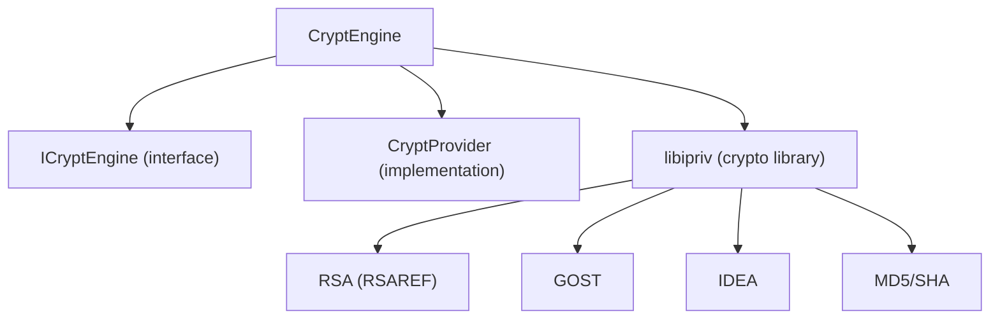

# CryptEngine

Cryptographic operations module using libipriv library.

## Purpose

Provides all cryptographic functionality for the payment terminal:

- Digital signatures (RSA, GOST)
- Encryption/decryption (IDEA, AES)
- Hashing (MD5, SHA-1, SHA-256)
- Hardware token integration

## Architecture



## Usage

```cpp
#include "CryptEngine/ICryptEngine.h"

// Get instance
ICryptEngine* crypto = CryptEngineFactory::create();

// Load keys
crypto->loadPrivateKey("keys/private.key", "password");

// Sign data
QByteArray signature = crypto->sign(paymentData);

// Verify
bool valid = crypto->verify(data, signature);
```

## Key Files

| File               | Purpose                |
| ------------------ | ---------------------- |
| `ICryptEngine.h`   | Public interface       |
| `CryptEngine.cpp`  | Main implementation    |
| `TokenManager.cpp` | Hardware token support |

## Dependencies

- `libipriv` (thirdparty)
- `App` module
- `Log` module

## Platform Support

| Platform | Status          |
| -------- | --------------- |
| Windows  | ✅ Full support |
| Linux    | 🔬 Experimental |
| macOS    | 🔬 Experimental |

## Configuration

```ini
[Crypto]
KeyPath=./keys/private.key
UseHardwareToken=false
```

## See Also

- [Full documentation](../../../../docs/modules/engines/cryptengine.md)
- [libipriv source](../../../../thirdparty/libipriv/)
