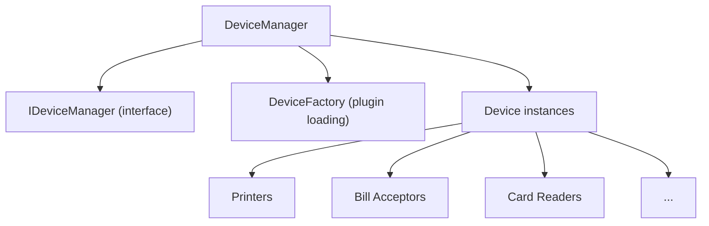

# DeviceManager

Hardware device lifecycle management module.

## Purpose

Manages all hardware devices:

- Device discovery and initialization
- Status monitoring
- Device pooling and access
- Hot-plug support (where available)

## Architecture



## Usage

```cpp
#include "DeviceManager/DeviceManager.h"

DeviceManager* dm = DeviceManager::instance();

// Initialize all devices
dm->initialize();

// Get specific device
IBillAcceptor* acceptor = dm->getDevice<IBillAcceptor>("CashCode_SM");
if (acceptor && acceptor->isReady()) {
    acceptor->enableAcceptance();
}

// Monitor status
connect(dm, &DeviceManager::deviceStatusChanged,
        this, &MyClass::onDeviceStatus);
```

## Key Files

| File               | Purpose        |
| ------------------ | -------------- |
| `DeviceManager.h`  | Main manager   |
| `IDeviceManager.h` | Interface      |
| `DevicePool.h`     | Device pooling |

## Device Lifecycle

```
1. scanPlugins() - Find driver plugins
2. createDevice() - Instantiate from factory
3. initialize() - Open ports, configure
4. [operational] - Normal use
5. release() - Cleanup
```

## Configuration

```ini
[Devices]
BillAcceptor=CashCode_SM
Printer=Custom_VKP80
CardReader=IDTech_SecuRED
AutoInitialize=true
```

## Dependencies

- `DriversSDK` module
- `PluginsSDK` module
- `HardwareCommon` module
- `Log` module

## Platform Support

| Platform | Status          |
| -------- | --------------- |
| Windows  | ✅ Full         |
| Linux    | 🔬 Experimental |
| macOS    | 🔬 Experimental |
