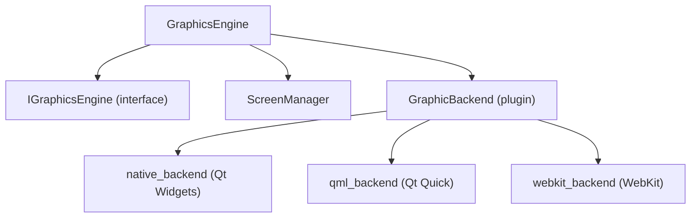

# GraphicsEngine

UI rendering coordination module.

## Purpose

Coordinates all UI rendering:

- Backend plugin management
- Screen transitions
- Widget lifecycle
- Theme/style management

## Architecture



## Usage

```cpp
#include "GraphicsEngine/GraphicsEngine.h"

GraphicsEngine* ge = GraphicsEngine::instance();

// Initialize with backend
ge->initialize("native_backend");

// Display screen
ge->displayScreen("main_menu", params);

// Handle user input
connect(ge, &GraphicsEngine::buttonClicked,
        scenario, &ScenarioEngine::onUserInput);
```

## Key Files

| File                | Purpose           |
| ------------------- | ----------------- |
| `GraphicsEngine.h`  | Main engine       |
| `IGraphicBackend.h` | Backend interface |
| `ScreenManager.h`   | Screen lifecycle  |

## Screen Lifecycle

```
1. loadScreen() - Parse definition
2. createWidgets() - Instantiate UI
3. showScreen() - Display to user
4. [interactive] - Handle events
5. hideScreen() - Transition out
6. destroyScreen() - Cleanup
```

## Configuration

```ini
[Graphics]
Backend=native_backend
FullScreen=true
Resolution=1920x1080
Theme=default
```

## Dependencies

- `GUISDK` module
- `PluginsSDK` module
- `SettingsManager` module

## Platform Support

| Platform | Status               |
| -------- | -------------------- |
| Windows  | ✅ Full              |
| Linux    | ✅ Full (native/qml) |
| macOS    | ✅ Full (native/qml) |

## Backend Selection

| Backend        | Best For     | Qt Modules   |
| -------------- | ------------ | ------------ |
| native_backend | Desktop apps | Qt Widgets   |
| qml_backend    | Touch UI     | Qt Quick     |
| webkit_backend | Web-based UI | Qt WebEngine |
