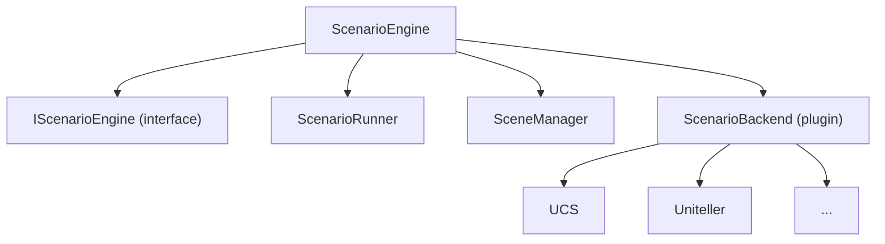
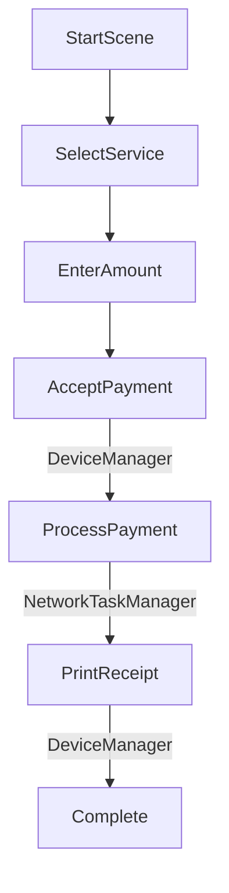

# ScenarioEngine

Payment workflow execution engine.

## Purpose

Executes payment scenarios (workflows):

- Screen navigation
- Payment processing steps
- Device interaction coordination
- State management

## Architecture



## Usage

```cpp
#include "ScenarioEngine/ScenarioEngine.h"

ScenarioEngine* engine = ScenarioEngine::instance();

// Load scenario
engine->loadScenario("payment_flow");

// Start execution
engine->start();

// Handle events
connect(engine, &ScenarioEngine::showScreen,
        graphics, &GraphicsEngine::displayScreen);
connect(engine, &ScenarioEngine::paymentComplete,
        this, &MyClass::onPaymentDone);
```

## Key Files

| File                 | Purpose           |
| -------------------- | ----------------- |
| `ScenarioEngine.h`   | Main engine       |
| `IScenarioBackend.h` | Backend interface |
| `SceneManager.h`     | Screen management |

## Scenario Flow



## Dependencies

- `GraphicsEngine` module
- `DeviceManager` module
- `NetworkTaskManager` module
- `PPSDK` module

## Platform Support

| Platform | Status          |
| -------- | --------------- |
| Windows  | ✅ Full         |
| Linux    | 🔬 Experimental |
| macOS    | 🔬 Experimental |

## ⚠️ Qt6 Migration Required

This module uses QtScript for JavaScript scenarios. **Migration to QJSEngine is required for Qt6.**

See [migration guide](../../../../docs/migration-guide.md) for details.
