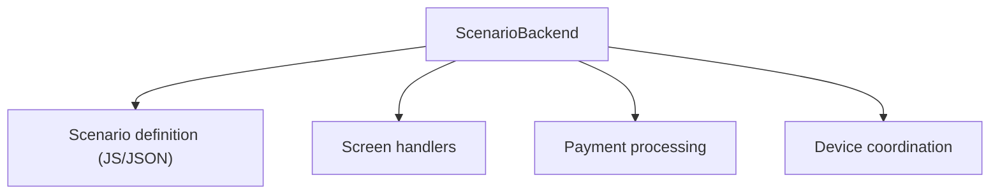
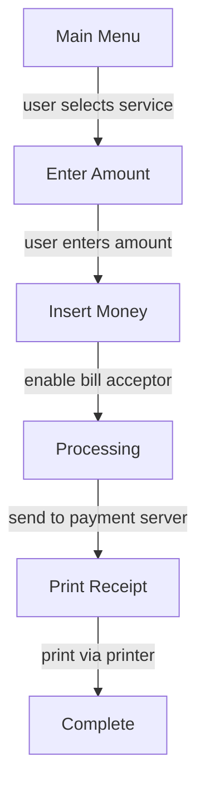

# Scenario Backend Plugins

Payment workflow (scenario) implementation plugins.

## Available Backends

| Plugin                  | Payment System     | Status          |
| ----------------------- | ------------------ | --------------- |
| [UCS](UCS/)             | UCS payment system | ⚠️ Qt migration |
| [Uniteller](Uniteller/) | Uniteller payments | ⚠️ Qt migration |

## What is a Scenario Backend?

A scenario backend implements the payment workflow logic:

- Screen flow (what screens to show)
- Payment processing steps
- Device interaction timing
- Error handling

## Architecture



## Creating a Backend

### 1. Implement IScenarioBackend

```cpp
#include <PPSDK/IScenarioBackend.h>

class MyScenarioBackend : public IScenarioBackend {
    Q_OBJECT
public:
    bool initialize() override;
    void shutdown() override;

    void startScenario(const QString& name) override;
    void stopScenario() override;

    void handleUserInput(const QString& screen,
                         const QString& input,
                         const QVariant& value) override;

signals:
    void showScreen(const QString& name,
                    const QVariantMap& params);
    void enableDevice(const QString& deviceType);
    void disableDevice(const QString& deviceType);
    void processPayment(const PaymentRequest& req);
    void scenarioComplete(bool success);
};
```

### 2. CMakeLists.txt

```cmake
file(GLOB SOURCES src/*.cpp src/*.h)

tc_add_scenario_backend(my_scenario
    SOURCES ${SOURCES}
    QT_MODULES Core Script  # Note: Script is Qt5 only
    DEPENDS PPSDK ScenarioEngine
)
```

## Scenario Flow Example



## ⚠️ Qt6 Migration Required

Current scenario backends use **QtScript** which is removed in Qt6.

### Migration Path

```cpp
// Qt5 (QtScript) - DEPRECATED
QScriptEngine engine;
QScriptValue result = engine.evaluate(script);

// Qt6 (QJSEngine) - MIGRATE TO THIS
QJSEngine engine;
QJSValue result = engine.evaluate(script);
```

### Migration Steps

1. Replace `QScriptEngine` with `QJSEngine`
2. Replace `QScriptValue` with `QJSValue`
3. Update JavaScript API bindings
4. Test all scenario flows

See [migration guide](../../../../docs/migration-guide.md) for details.

## Platform Support

| Platform | Status | Notes              |
| -------- | ------ | ------------------ |
| Windows  | ✅     | Full with Qt5      |
| Linux    | 🔬     | Needs testing      |
| macOS    | 🔬     | Needs testing      |
| Qt6      | ❌     | Requires migration |

## Dependencies

- `PPSDK` - Payment interfaces
- `ScenarioEngine` - Engine integration
- `NetworkTaskManager` - Server communication
- Qt Script module (Qt5 only)
